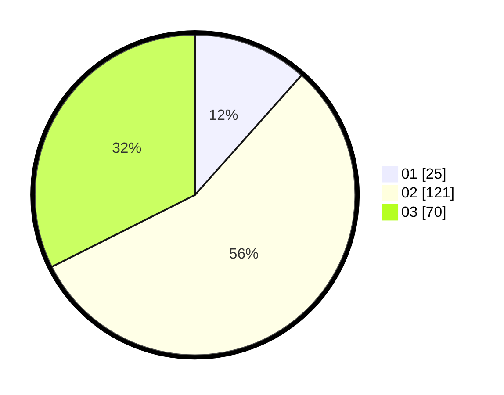

# Hasil

Hasil perolehan suara paslon dapat dilihat pada file paslon-01.txt, paslon-02.txt, dan paslon-03.txt.

Jika tidak ada, artinya data tersebut belum ada pada SIREKAP.

## Perolehan Suara

 * Paslon 01: **25**.
 * Paslon 02: **121**.
 * Paslon 03: **70**.

## Foto C Plano

https://sirekap-obj-formc.kpu.go.id/df4c/pemilu/ppwp/31/71/04/10/02/3171041002033-20240214-220112--6616e301-a57f-4291-98b5-ff6119a3481e.jpg

https://sirekap-obj-formc.kpu.go.id/df4c/pemilu/ppwp/31/71/04/10/02/3171041002033-20240214-211230--01f5c6bb-bb2b-44a9-af39-d36e356555f6.jpg

https://sirekap-obj-formc.kpu.go.id/df4c/pemilu/ppwp/31/71/04/10/02/3171041002033-20240214-211325--07cffba2-f69b-4e9a-9991-d02f2ab384d4.jpg

## DATA PEMILIH TETAP

Jumlah pemilih dalam DPT: **206**.
 * L: **89**.
 * P: **117**.

## DATA PENGGUNA HAK PILIH

Jumlah pengguna hak pilih dalam DPT: **206**.
 * L: **89**.
 * P: **117**.

Jumlah pengguna hak pilih dalam DPTb: **7**.
 * L: **2**.
 * P: **5**.

Jumlah pengguna hak pilih dalam DPK: **4**.
 * L: **1**.
 * P: **3**.

Jumlah pengguna hak pilih: **217**.
 * L: **92**.
 * P: **125**.

## JUMLAH SUARA SAH DAN TIDAK SAH

JUMLAH SELURUH SUARA SAH: **216**.

JUMLAH SUARA TIDAK SAH: **1**.

JUMLAH SELURUH SUARA SAH DAN SUARA TIDAK SAH: **217**.
