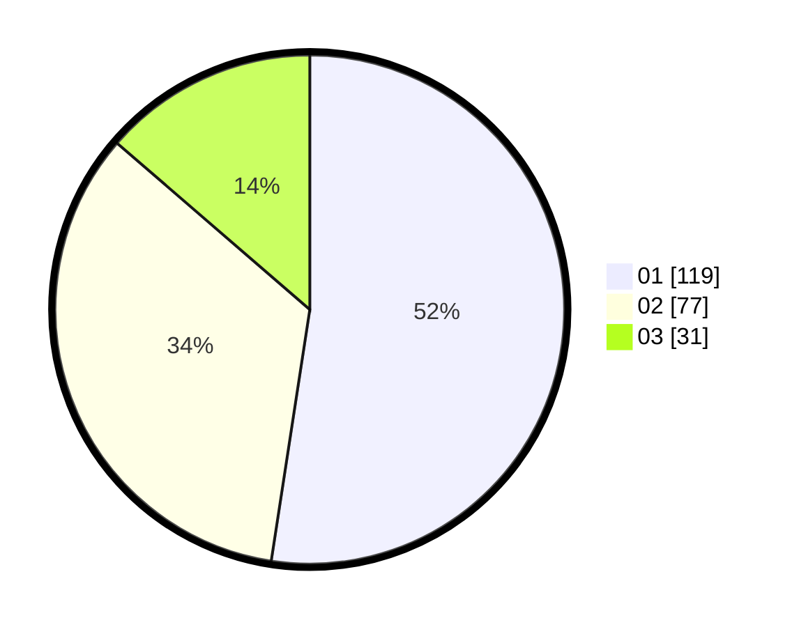

# Hasil

Hasil perolehan suara paslon dapat dilihat pada file paslon-01.txt, paslon-02.txt, dan paslon-03.txt.

Jika tidak ada, artinya data tersebut belum ada pada SIREKAP.

## Perolehan Suara

 * Paslon 01: **119**.
 * Paslon 02: **77**.
 * Paslon 03: **31**.

## Foto C Plano

https://sirekap-obj-formc.kpu.go.id/1025/pemilu/ppwp/31/71/04/10/03/3171041003004-20240219-133100--96b6b8d1-795a-4153-9147-d82bdc03760e.jpg

https://sirekap-obj-formc.kpu.go.id/1025/pemilu/ppwp/31/71/04/10/03/3171041003004-20240219-133355--462fe6ad-8e4c-40b7-8265-8654d9a6ccda.jpg

https://sirekap-obj-formc.kpu.go.id/1025/pemilu/ppwp/31/71/04/10/03/3171041003004-20240219-133530--80e77bda-183c-49c6-b96a-487d269a3c66.jpg

## DATA PEMILIH TETAP

Jumlah pemilih dalam DPT: **280**.
 * L: **136**.
 * P: **144**.

## DATA PENGGUNA HAK PILIH

Jumlah pengguna hak pilih dalam DPT: **212**.
 * L: **99**.
 * P: **113**.

Jumlah pengguna hak pilih dalam DPTb: **11**.
 * L: **7**.
 * P: **4**.

Jumlah pengguna hak pilih dalam DPK: **7**.
 * L: **5**.
 * P: **2**.

Jumlah pengguna hak pilih: **230**.
 * L: **111**.
 * P: **119**.

## JUMLAH SUARA SAH DAN TIDAK SAH

JUMLAH SELURUH SUARA SAH: **227**.

JUMLAH SUARA TIDAK SAH: **3**.

JUMLAH SELURUH SUARA SAH DAN SUARA TIDAK SAH: **230**.
