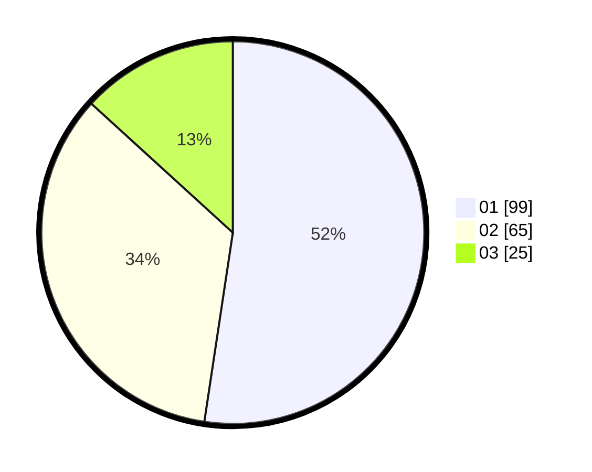

# Hasil

Hasil perolehan suara paslon dapat dilihat pada file paslon-01.txt, paslon-02.txt, dan paslon-03.txt.

Jika tidak ada, artinya data tersebut belum ada pada SIREKAP.

## Perolehan Suara

 * Paslon 01: **99**.
 * Paslon 02: **65**.
 * Paslon 03: **25**.

## Foto C Plano

https://sirekap-obj-formc.kpu.go.id/ca1e/pemilu/ppwp/31/71/04/10/03/3171041003007-20240215-023224--26e1dc88-7d82-425e-98e1-59d7f668ab29.jpg

https://sirekap-obj-formc.kpu.go.id/ca1e/pemilu/ppwp/31/71/04/10/03/3171041003007-20240214-231734--ae343503-04b8-47d5-b017-09d79abea858.jpg

https://sirekap-obj-formc.kpu.go.id/ca1e/pemilu/ppwp/31/71/04/10/03/3171041003007-20240214-231902--31a4016e-01b5-4c7c-b1b8-96e88e87660a.jpg

## DATA PEMILIH TETAP

Jumlah pemilih dalam DPT: **277**.
 * L: **139**.
 * P: **138**.

## DATA PENGGUNA HAK PILIH

Jumlah pengguna hak pilih dalam DPT: **178**.
 * L: **91**.
 * P: **87**.

Jumlah pengguna hak pilih dalam DPTb: **9**.
 * L: **1**.
 * P: **8**.

Jumlah pengguna hak pilih dalam DPK: **4**.
 * L: **1**.
 * P: **3**.

Jumlah pengguna hak pilih: **191**.
 * L: **93**.
 * P: **8**.

## JUMLAH SUARA SAH DAN TIDAK SAH

JUMLAH SELURUH SUARA SAH: **189**.

JUMLAH SUARA TIDAK SAH: **2**.

JUMLAH SELURUH SUARA SAH DAN SUARA TIDAK SAH: **191**.
