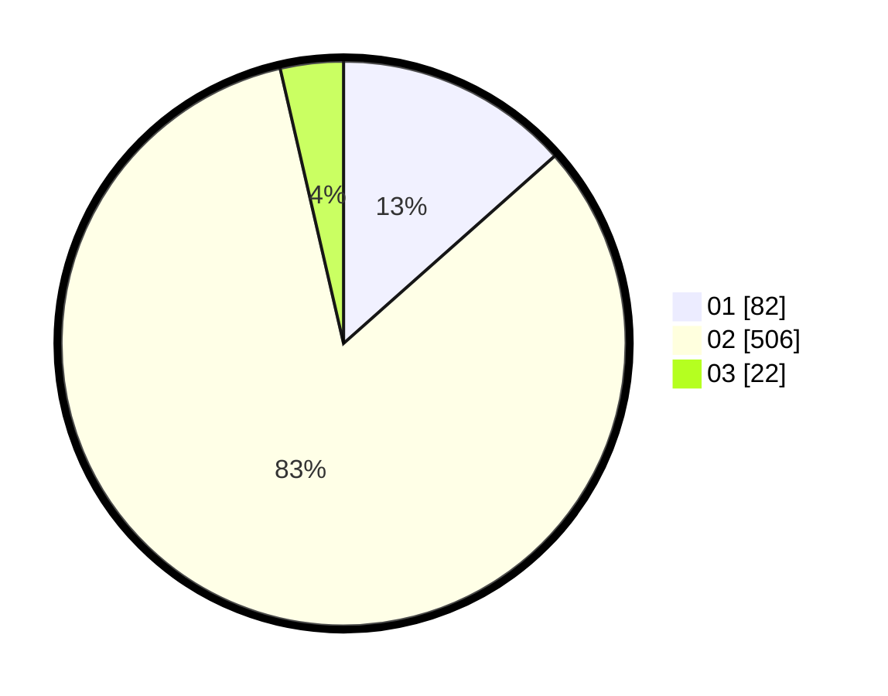

# Hasil

Hasil perolehan suara paslon dapat dilihat pada file paslon-01.txt, paslon-02.txt, dan paslon-03.txt.

Jika tidak ada, artinya data tersebut belum ada pada SIREKAP.

## Perolehan Suara

 * Paslon 01: **82**.
 * Paslon 02: **506**.
 * Paslon 03: **22**.

## Foto C Plano

https://sirekap-obj-formc.kpu.go.id/c719/pemilu/ppwp/31/71/04/10/03/3171041003009-20240216-092715--94873c00-86c1-4b50-b386-d7418f02b553.jpg

https://sirekap-obj-formc.kpu.go.id/c719/pemilu/ppwp/31/71/04/10/03/3171041003009-20240219-141434--8d97a3d7-6fca-475d-8be2-bf98b8774413.jpg

https://sirekap-obj-formc.kpu.go.id/c719/pemilu/ppwp/31/71/04/10/03/3171041003009-20240219-135939--4935929c-6a68-49ef-bd97-c2f33e8b1964.jpg

## DATA PEMILIH TETAP

Jumlah pemilih dalam DPT: **286**.
 * L: **149**.
 * P: **137**.

## DATA PENGGUNA HAK PILIH

Jumlah pengguna hak pilih dalam DPT: **160**.
 * L: **75**.
 * P: **85**.

Jumlah pengguna hak pilih dalam DPTb: **7**.
 * L: **1**.
 * P: **6**.

Jumlah pengguna hak pilih dalam DPK: **3**.
 * L: **0**.
 * P: **3**.

Jumlah pengguna hak pilih: **170**.
 * L: **76**.
 * P: **94**.

## JUMLAH SUARA SAH DAN TIDAK SAH

JUMLAH SELURUH SUARA SAH: **169**.

JUMLAH SUARA TIDAK SAH: **1**.

JUMLAH SELURUH SUARA SAH DAN SUARA TIDAK SAH: **170**.
