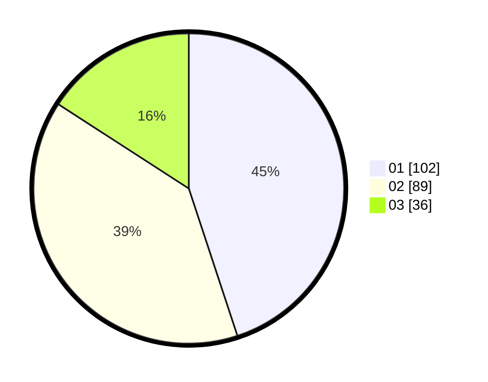

# Hasil

Hasil perolehan suara paslon dapat dilihat pada file paslon-01.txt, paslon-02.txt, dan paslon-03.txt.

Jika tidak ada, artinya data tersebut belum ada pada SIREKAP.

## Perolehan Suara

 * Paslon 01: **102**.
 * Paslon 02: **89**.
 * Paslon 03: **36**.

## Foto C Plano

https://sirekap-obj-formc.kpu.go.id/f94b/pemilu/ppwp/31/71/04/10/03/3171041003010-20240217-111857--981188af-01b7-49c0-8143-4dade6586c64.jpg

https://sirekap-obj-formc.kpu.go.id/f94b/pemilu/ppwp/31/71/04/10/03/3171041003010-20240215-001351--03d8218b-17bc-41c0-b566-0f2e25464e76.jpg

https://sirekap-obj-formc.kpu.go.id/f94b/pemilu/ppwp/31/71/04/10/03/3171041003010-20240215-001757--d473c3db-55b7-46ca-b17b-af02a27d805a.jpg

## DATA PEMILIH TETAP

Jumlah pemilih dalam DPT: **283**.
 * L: **145**.
 * P: **138**.

## DATA PENGGUNA HAK PILIH

Jumlah pengguna hak pilih dalam DPT: **214**.
 * L: **107**.
 * P: **107**.

Jumlah pengguna hak pilih dalam DPTb: **14**.
 * L: **5**.
 * P: **9**.

Jumlah pengguna hak pilih dalam DPK: **1**.
 * L: **0**.
 * P: **1**.

Jumlah pengguna hak pilih: **229**.
 * L: **112**.
 * P: **117**.

## JUMLAH SUARA SAH DAN TIDAK SAH

JUMLAH SELURUH SUARA SAH: **227**.

JUMLAH SUARA TIDAK SAH: **2**.

JUMLAH SELURUH SUARA SAH DAN SUARA TIDAK SAH: **229**.
