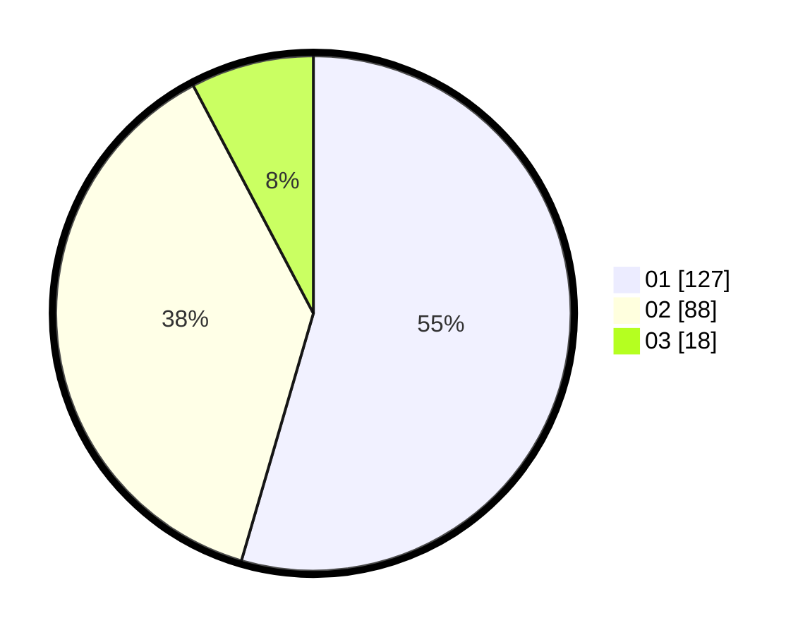

# Hasil

Hasil perolehan suara paslon dapat dilihat pada file paslon-01.txt, paslon-02.txt, dan paslon-03.txt.

Jika tidak ada, artinya data tersebut belum ada pada SIREKAP.

## Perolehan Suara

 * Paslon 01: **127**.
 * Paslon 02: **88**.
 * Paslon 03: **18**.

## Foto C Plano

https://sirekap-obj-formc.kpu.go.id/76d6/pemilu/ppwp/31/71/04/10/03/3171041003011-20240214-192018--a780f792-6407-4bf2-beab-87be8f5405d7.jpg

https://sirekap-obj-formc.kpu.go.id/76d6/pemilu/ppwp/31/71/04/10/03/3171041003011-20240215-001111--1c4c9b32-b359-48cb-ad9f-b4c87dc7a2bf.jpg

https://sirekap-obj-formc.kpu.go.id/76d6/pemilu/ppwp/31/71/04/10/03/3171041003011-20240214-192138--6708794e-197d-4e88-b109-f973d8b74d5f.jpg

## DATA PEMILIH TETAP

Jumlah pemilih dalam DPT: **274**.
 * L: **129**.
 * P: **145**.

## DATA PENGGUNA HAK PILIH

Jumlah pengguna hak pilih dalam DPT: **230**.
 * L: **105**.
 * P: **125**.

Jumlah pengguna hak pilih dalam DPTb: **4**.
 * L: **2**.
 * P: **2**.

Jumlah pengguna hak pilih dalam DPK: **0**.
 * L: **0**.
 * P: **0**.

Jumlah pengguna hak pilih: **234**.
 * L: **107**.
 * P: **127**.

## JUMLAH SUARA SAH DAN TIDAK SAH

JUMLAH SELURUH SUARA SAH: **233**.

JUMLAH SUARA TIDAK SAH: **1**.

JUMLAH SELURUH SUARA SAH DAN SUARA TIDAK SAH: **234**.
