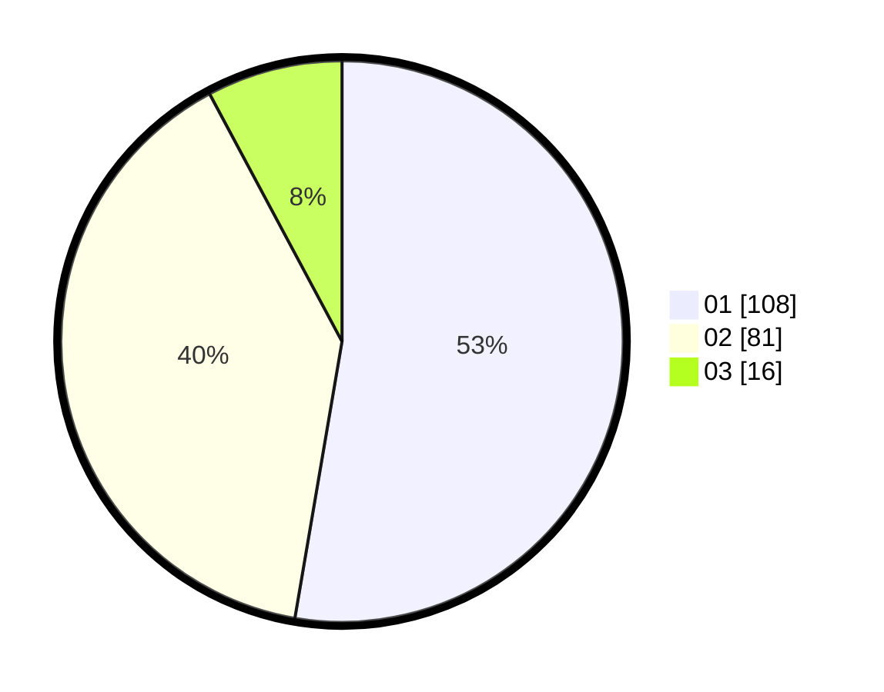

# Hasil

Hasil perolehan suara paslon dapat dilihat pada file paslon-01.txt, paslon-02.txt, dan paslon-03.txt.

Jika tidak ada, artinya data tersebut belum ada pada SIREKAP.

## Perolehan Suara

 * Paslon 01: **108**.
 * Paslon 02: **81**.
 * Paslon 03: **16**.

## Foto C Plano

https://sirekap-obj-formc.kpu.go.id/e265/pemilu/ppwp/31/71/04/10/03/3171041003016-20240216-152756--55205159-8e11-44b3-9f2a-b190c60850c0.jpg

https://sirekap-obj-formc.kpu.go.id/e265/pemilu/ppwp/31/71/04/10/03/3171041003016-20240216-152757--a4f36802-f843-4599-ae70-799fd8a93f42.jpg

https://sirekap-obj-formc.kpu.go.id/e265/pemilu/ppwp/31/71/04/10/03/3171041003016-20240216-152757--c69930af-7eae-4fa9-9737-1fe75bceb134.jpg

## DATA PEMILIH TETAP

Jumlah pemilih dalam DPT: **268**.
 * L: **141**.
 * P: **127**.

## DATA PENGGUNA HAK PILIH

Jumlah pengguna hak pilih dalam DPT: **198**.
 * L: **98**.
 * P: **100**.

Jumlah pengguna hak pilih dalam DPTb: **6**.
 * L: **2**.
 * P: **4**.

Jumlah pengguna hak pilih dalam DPK: **10**.
 * L: **8**.
 * P: **2**.

Jumlah pengguna hak pilih: **214**.
 * L: **108**.
 * P: **106**.

## JUMLAH SUARA SAH DAN TIDAK SAH

JUMLAH SELURUH SUARA SAH: **205**.

JUMLAH SUARA TIDAK SAH: **3**.

JUMLAH SELURUH SUARA SAH DAN SUARA TIDAK SAH: **208**.
