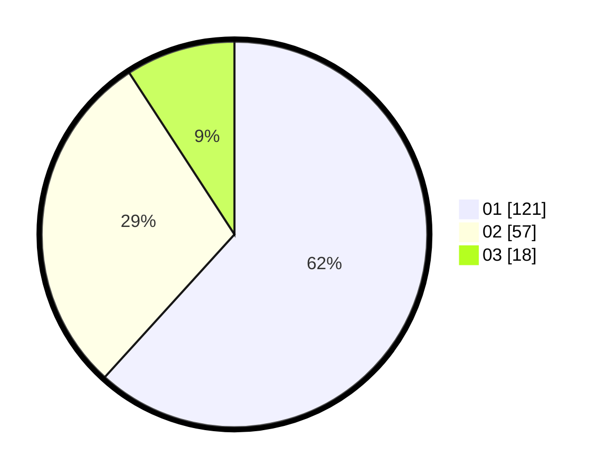

# Hasil

Hasil perolehan suara paslon dapat dilihat pada file paslon-01.txt, paslon-02.txt, dan paslon-03.txt.

Jika tidak ada, artinya data tersebut belum ada pada SIREKAP.

## Perolehan Suara

 * Paslon 01: **121**.
 * Paslon 02: **57**.
 * Paslon 03: **18**.

## Foto C Plano

https://sirekap-obj-formc.kpu.go.id/07de/pemilu/ppwp/31/71/04/10/03/3171041003018-20240214-212636--02e5074c-478a-41ed-add0-340e69266ecc.jpg

https://sirekap-obj-formc.kpu.go.id/07de/pemilu/ppwp/31/71/04/10/03/3171041003018-20240216-104029--070a814a-082a-469c-ae2b-d2fa5dd9cddf.jpg

https://sirekap-obj-formc.kpu.go.id/07de/pemilu/ppwp/31/71/04/10/03/3171041003018-20240215-182619--979480a5-10ed-4200-958b-ded2ff8b550e.jpg

## DATA PEMILIH TETAP

Jumlah pemilih dalam DPT: **260**.
 * L: **134**.
 * P: **126**.

## DATA PENGGUNA HAK PILIH

Jumlah pengguna hak pilih dalam DPT: **192**.
 * L: **97**.
 * P: **95**.

Jumlah pengguna hak pilih dalam DPTb: **4**.
 * L: **2**.
 * P: **2**.

Jumlah pengguna hak pilih dalam DPK: **2**.
 * L: **1**.
 * P: **1**.

Jumlah pengguna hak pilih: **198**.
 * L: **100**.
 * P: **98**.

## JUMLAH SUARA SAH DAN TIDAK SAH

JUMLAH SELURUH SUARA SAH: **196**.

JUMLAH SUARA TIDAK SAH: **2**.

JUMLAH SELURUH SUARA SAH DAN SUARA TIDAK SAH: **198**.
