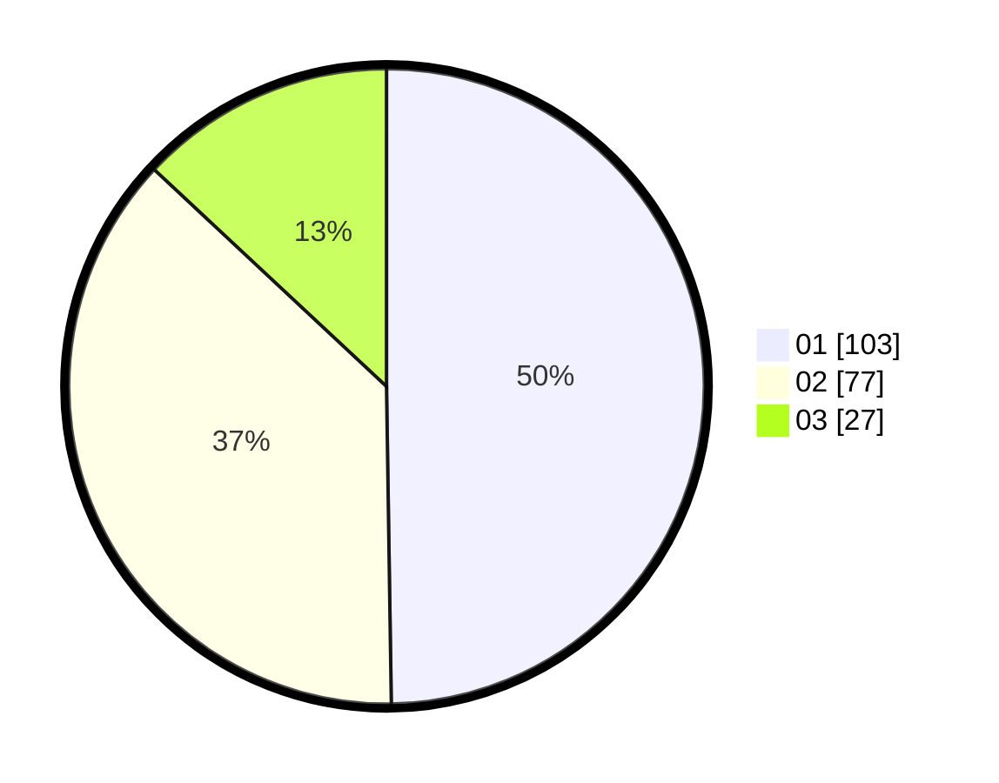

# Hasil

Hasil perolehan suara paslon dapat dilihat pada file paslon-01.txt, paslon-02.txt, dan paslon-03.txt.

Jika tidak ada, artinya data tersebut belum ada pada SIREKAP.

## Perolehan Suara

 * Paslon 01: **103**.
 * Paslon 02: **77**.
 * Paslon 03: **27**.

## Foto C Plano

https://sirekap-obj-formc.kpu.go.id/66eb/pemilu/ppwp/31/71/04/10/03/3171041003028-20240214-221443--55107fe6-e88d-414d-98b6-a2ddead8e253.jpg

https://sirekap-obj-formc.kpu.go.id/66eb/pemilu/ppwp/31/71/04/10/03/3171041003028-20240214-221446--24bec74c-5158-48e7-b298-5b7b986387cb.jpg

https://sirekap-obj-formc.kpu.go.id/66eb/pemilu/ppwp/31/71/04/10/03/3171041003028-20240214-221448--86de4842-7df7-4fe7-8371-23500ab5634c.jpg

## DATA PEMILIH TETAP

Jumlah pemilih dalam DPT: **255**.
 * L: **138**.
 * P: **117**.

## DATA PENGGUNA HAK PILIH

Jumlah pengguna hak pilih dalam DPT: **187**.
 * L: **94**.
 * P: **93**.

Jumlah pengguna hak pilih dalam DPTb: **22**.
 * L: **7**.
 * P: **15**.

Jumlah pengguna hak pilih dalam DPK: **0**.
 * L: **0**.
 * P: **0**.

Jumlah pengguna hak pilih: **209**.
 * L: **101**.
 * P: **108**.

## JUMLAH SUARA SAH DAN TIDAK SAH

JUMLAH SELURUH SUARA SAH: **207**.

JUMLAH SUARA TIDAK SAH: **2**.

JUMLAH SELURUH SUARA SAH DAN SUARA TIDAK SAH: **209**.
