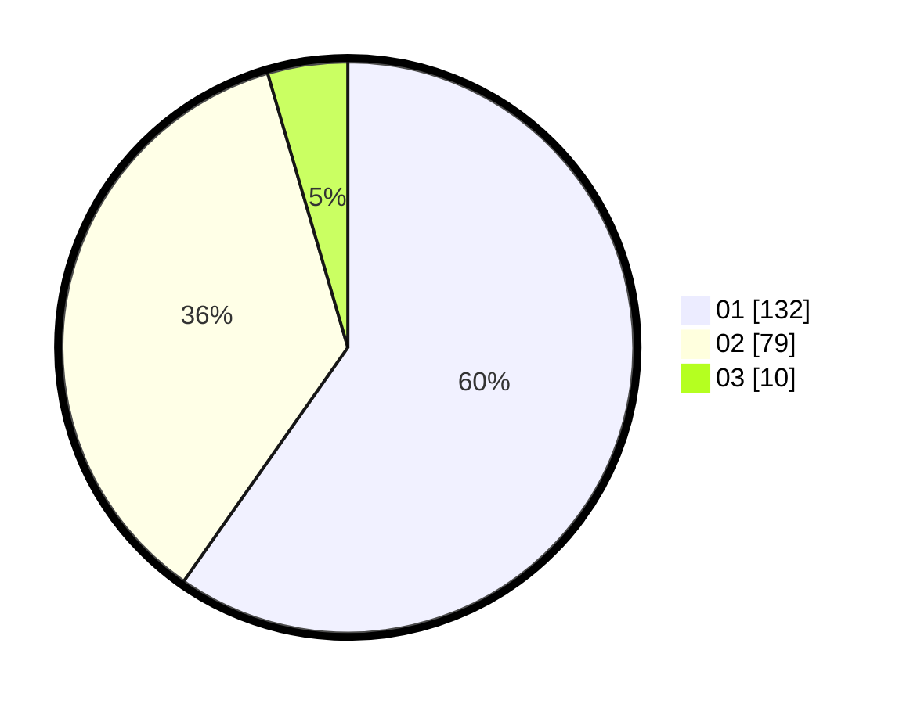

# Hasil

Hasil perolehan suara paslon dapat dilihat pada file paslon-01.txt, paslon-02.txt, dan paslon-03.txt.

Jika tidak ada, artinya data tersebut belum ada pada SIREKAP.

## Perolehan Suara

 * Paslon 01: **132**.
 * Paslon 02: **79**.
 * Paslon 03: **10**.

## Foto C Plano

https://sirekap-obj-formc.kpu.go.id/3a9f/pemilu/ppwp/31/71/04/10/03/3171041003030-20240215-010416--7e84a8e4-2f5f-485d-98f8-fcaad1b1f0f1.jpg

https://sirekap-obj-formc.kpu.go.id/3a9f/pemilu/ppwp/31/71/04/10/03/3171041003030-20240215-010517--701eebac-5b5c-43f7-a218-83a1396a9c66.jpg
