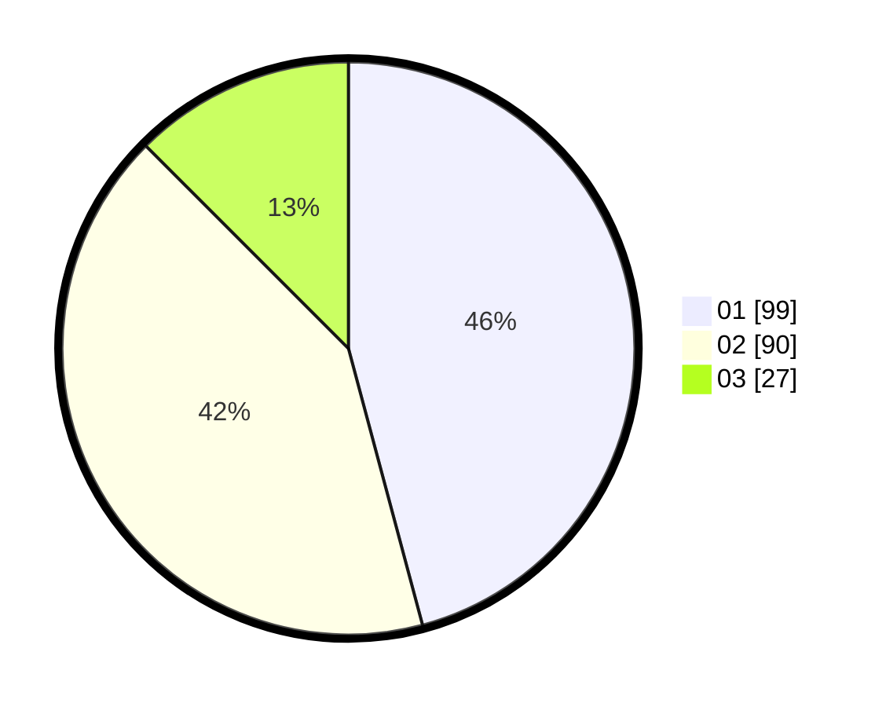

# Hasil

Hasil perolehan suara paslon dapat dilihat pada file paslon-01.txt, paslon-02.txt, dan paslon-03.txt.

Jika tidak ada, artinya data tersebut belum ada pada SIREKAP.

## Perolehan Suara

 * Paslon 01: **99**.
 * Paslon 02: **90**.
 * Paslon 03: **27**.

## Foto C Plano

https://sirekap-obj-formc.kpu.go.id/354f/pemilu/ppwp/31/71/04/10/03/3171041003037-20240214-230954--f3995fbf-85c3-475b-acf0-ddcced3b7913.jpg

https://sirekap-obj-formc.kpu.go.id/354f/pemilu/ppwp/31/71/04/10/03/3171041003037-20240214-192959--ae729cc9-807e-4c24-a6ca-75573141a7d4.jpg

https://sirekap-obj-formc.kpu.go.id/354f/pemilu/ppwp/31/71/04/10/03/3171041003037-20240214-192004--56f37faa-2aeb-4a7d-9ddd-b57b6718e3a4.jpg

## DATA PEMILIH TETAP

Jumlah pemilih dalam DPT: **266**.
 * L: **130**.
 * P: **136**.

## DATA PENGGUNA HAK PILIH

Jumlah pengguna hak pilih dalam DPT: **203**.
 * L: **98**.
 * P: **105**.

Jumlah pengguna hak pilih dalam DPTb: **14**.
 * L: **2**.
 * P: **12**.

Jumlah pengguna hak pilih dalam DPK: **2**.
 * L: **1**.
 * P: **1**.

Jumlah pengguna hak pilih: **219**.
 * L: **101**.
 * P: **118**.

## JUMLAH SUARA SAH DAN TIDAK SAH

JUMLAH SELURUH SUARA SAH: **216**.

JUMLAH SUARA TIDAK SAH: **3**.

JUMLAH SELURUH SUARA SAH DAN SUARA TIDAK SAH: **219**.
