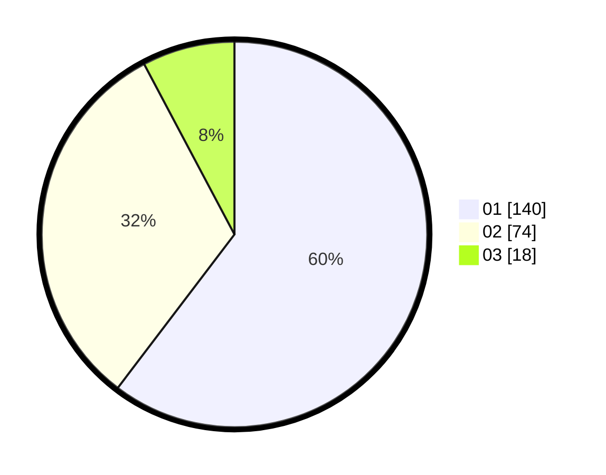

# Hasil

Hasil perolehan suara paslon dapat dilihat pada file paslon-01.txt, paslon-02.txt, dan paslon-03.txt.

Jika tidak ada, artinya data tersebut belum ada pada SIREKAP.

## Perolehan Suara

 * Paslon 01: **140**.
 * Paslon 02: **74**.
 * Paslon 03: **18**.

## Foto C Plano

https://sirekap-obj-formc.kpu.go.id/6873/pemilu/ppwp/31/71/04/10/03/3171041003050-20240214-234929--86f6eb45-e2b6-4d07-aecb-46cb7d2b594e.jpg

https://sirekap-obj-formc.kpu.go.id/6873/pemilu/ppwp/31/71/04/10/03/3171041003050-20240214-235022--4c0a852d-170e-4d3e-b4f4-f149bd96c058.jpg

https://sirekap-obj-formc.kpu.go.id/6873/pemilu/ppwp/31/71/04/10/03/3171041003050-20240214-235112--374d64a8-4452-4865-ab84-8bb6766e418b.jpg

## DATA PEMILIH TETAP

Jumlah pemilih dalam DPT: **259**.
 * L: **134**.
 * P: **125**.

## DATA PENGGUNA HAK PILIH

Jumlah pengguna hak pilih dalam DPT: **205**.
 * L: **100**.
 * P: **105**.

Jumlah pengguna hak pilih dalam DPTb: **26**.
 * L: **3**.
 * P: **23**.

Jumlah pengguna hak pilih dalam DPK: **5**.
 * L: **1**.
 * P: **4**.

Jumlah pengguna hak pilih: **236**.
 * L: **104**.
 * P: **236**.

## JUMLAH SUARA SAH DAN TIDAK SAH

JUMLAH SELURUH SUARA SAH: **232**.

JUMLAH SUARA TIDAK SAH: **4**.

JUMLAH SELURUH SUARA SAH DAN SUARA TIDAK SAH: **236**.
