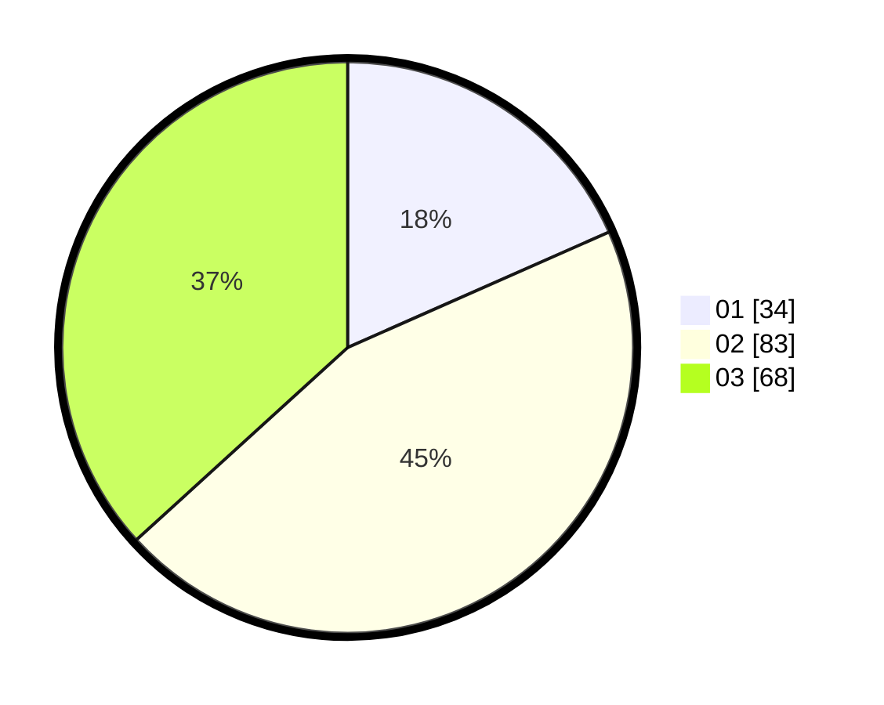

# Hasil

Hasil perolehan suara paslon dapat dilihat pada file paslon-01.txt, paslon-02.txt, dan paslon-03.txt.

Jika tidak ada, artinya data tersebut belum ada pada SIREKAP.

## Perolehan Suara

 * Paslon 01: **34**.
 * Paslon 02: **83**.
 * Paslon 03: **68**.

## Foto C Plano

https://sirekap-obj-formc.kpu.go.id/7792/pemilu/ppwp/31/71/04/10/03/3171041003052-20240214-222627--4ff1ed11-90c8-4742-83c7-d7aa2c4082ff.jpg

https://sirekap-obj-formc.kpu.go.id/7792/pemilu/ppwp/31/71/04/10/03/3171041003052-20240214-222816--425f1add-ff6b-4bcb-90cf-239036b2aeb7.jpg
