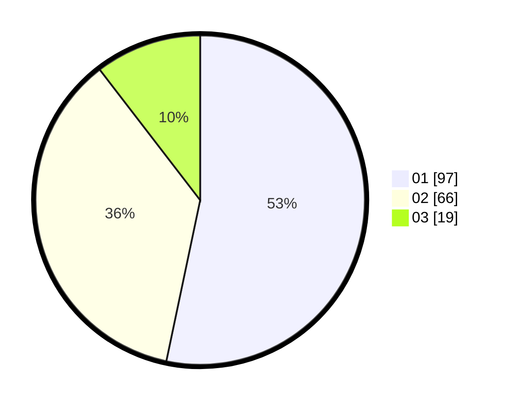

# Hasil

Hasil perolehan suara paslon dapat dilihat pada file paslon-01.txt, paslon-02.txt, dan paslon-03.txt.

Jika tidak ada, artinya data tersebut belum ada pada SIREKAP.

## Perolehan Suara

 * Paslon 01: **97**.
 * Paslon 02: **66**.
 * Paslon 03: **19**.

## Foto C Plano

https://sirekap-obj-formc.kpu.go.id/79b8/pemilu/ppwp/31/71/04/10/03/3171041003056-20240215-021427--a0608f15-4d6b-4865-9dfe-ad454463d196.jpg

https://sirekap-obj-formc.kpu.go.id/79b8/pemilu/ppwp/31/71/04/10/03/3171041003056-20240215-021533--b132a645-20f1-42ea-a093-69e8d4ceb261.jpg
