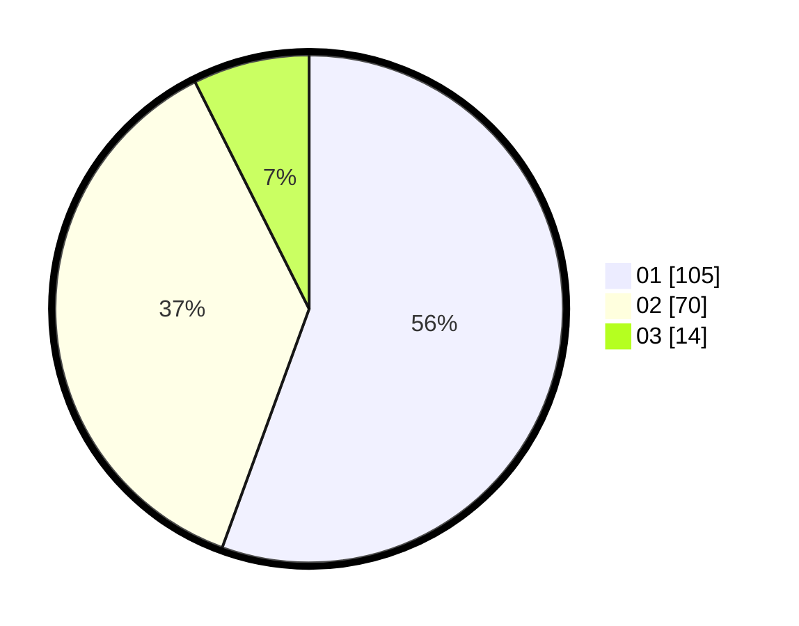

# Hasil

Hasil perolehan suara paslon dapat dilihat pada file paslon-01.txt, paslon-02.txt, dan paslon-03.txt.

Jika tidak ada, artinya data tersebut belum ada pada SIREKAP.

## Perolehan Suara

 * Paslon 01: **105**.
 * Paslon 02: **70**.
 * Paslon 03: **14**.

## Foto C Plano

https://sirekap-obj-formc.kpu.go.id/3d7a/pemilu/ppwp/31/71/04/10/03/3171041003059-20240214-205742--31ab3665-ba34-4548-a44f-4142cac88956.jpg

https://sirekap-obj-formc.kpu.go.id/3d7a/pemilu/ppwp/31/71/04/10/03/3171041003059-20240214-205828--eb685bd7-057e-4e41-9b6a-d0ed5e10b586.jpg
