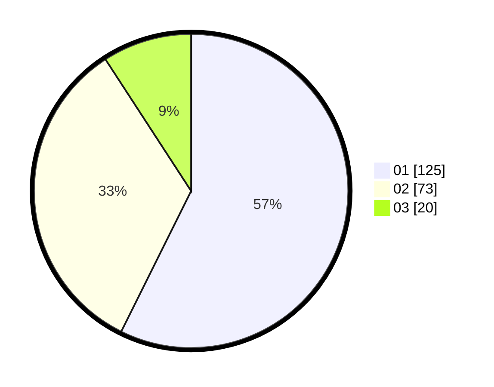

# Hasil

Hasil perolehan suara paslon dapat dilihat pada file paslon-01.txt, paslon-02.txt, dan paslon-03.txt.

Jika tidak ada, artinya data tersebut belum ada pada SIREKAP.

## Perolehan Suara

 * Paslon 01: **125**.
 * Paslon 02: **73**.
 * Paslon 03: **20**.

## Foto C Plano

https://sirekap-obj-formc.kpu.go.id/e7da/pemilu/ppwp/31/71/04/10/03/3171041003063-20240216-064527--36375f2b-31c4-479c-aed0-5df74222ce41.jpg

https://sirekap-obj-formc.kpu.go.id/e7da/pemilu/ppwp/31/71/04/10/03/3171041003063-20240216-064530--4d538282-ca31-4f1f-a1dd-615a161ade29.jpg

https://sirekap-obj-formc.kpu.go.id/e7da/pemilu/ppwp/31/71/04/10/03/3171041003063-20240216-064528--7a254c3f-0f84-4b42-bc64-6fd0f271e06e.jpg

## DATA PEMILIH TETAP

Jumlah pemilih dalam DPT: **250**.
 * L: **121**.
 * P: **129**.

## DATA PENGGUNA HAK PILIH

Jumlah pengguna hak pilih dalam DPT: **199**.
 * L: **99**.
 * P: **100**.

Jumlah pengguna hak pilih dalam DPTb: **16**.
 * L: **13**.
 * P: **3**.

Jumlah pengguna hak pilih dalam DPK: **3**.
 * L: **2**.
 * P: **1**.

Jumlah pengguna hak pilih: **218**.
 * L: **114**.
 * P: **104**.

## JUMLAH SUARA SAH DAN TIDAK SAH

JUMLAH SELURUH SUARA SAH: **218**.

JUMLAH SUARA TIDAK SAH: **0**.

JUMLAH SELURUH SUARA SAH DAN SUARA TIDAK SAH: **218**.
