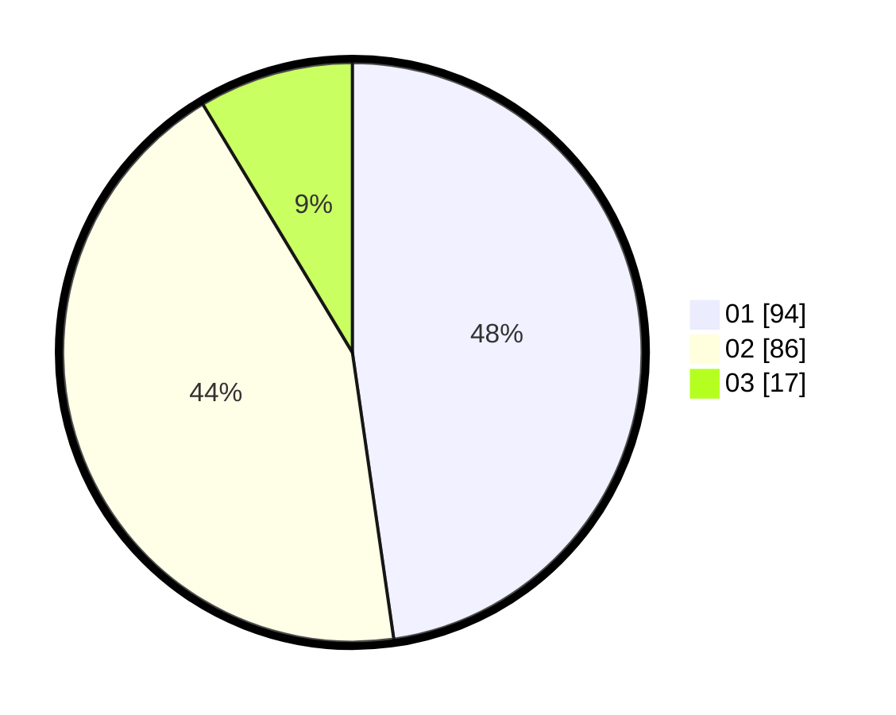

# Hasil

Hasil perolehan suara paslon dapat dilihat pada file paslon-01.txt, paslon-02.txt, dan paslon-03.txt.

Jika tidak ada, artinya data tersebut belum ada pada SIREKAP.

## Perolehan Suara

 * Paslon 01: **94**.
 * Paslon 02: **86**.
 * Paslon 03: **17**.

## Foto C Plano

https://sirekap-obj-formc.kpu.go.id/4957/pemilu/ppwp/31/71/04/10/03/3171041003064-20240214-185927--e2b04099-85be-4090-adc8-bd2445ae703c.jpg

https://sirekap-obj-formc.kpu.go.id/4957/pemilu/ppwp/31/71/04/10/03/3171041003064-20240214-190042--eb861a28-c2e1-4dda-8988-1a35351d5cea.jpg

https://sirekap-obj-formc.kpu.go.id/4957/pemilu/ppwp/31/71/04/10/03/3171041003064-20240214-185445--fec9ddc9-f5d3-4185-8234-2fe25f7fc3f3.jpg

## DATA PEMILIH TETAP

Jumlah pemilih dalam DPT: **261**.
 * L: **127**.
 * P: **134**.

## DATA PENGGUNA HAK PILIH

Jumlah pengguna hak pilih dalam DPT: **183**.
 * L: **83**.
 * P: **100**.

Jumlah pengguna hak pilih dalam DPTb: **12**.
 * L: **1**.
 * P: **11**.

Jumlah pengguna hak pilih dalam DPK: **4**.
 * L: **3**.
 * P: **1**.

Jumlah pengguna hak pilih: **199**.
 * L: **87**.
 * P: **112**.

## JUMLAH SUARA SAH DAN TIDAK SAH

JUMLAH SELURUH SUARA SAH: **197**.

JUMLAH SUARA TIDAK SAH: **2**.

JUMLAH SELURUH SUARA SAH DAN SUARA TIDAK SAH: **199**.
