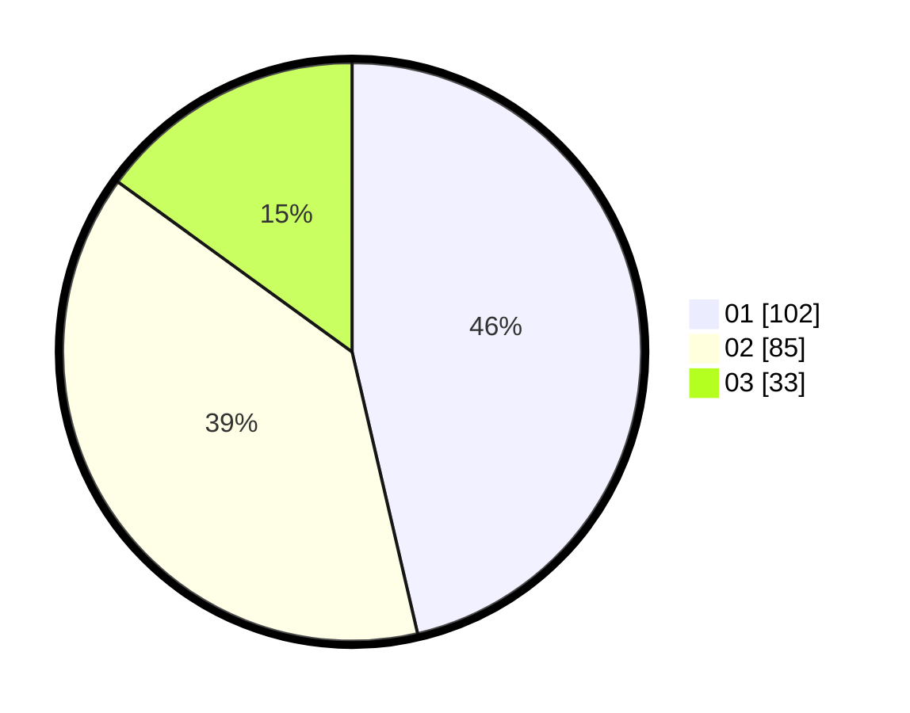

# Hasil

Hasil perolehan suara paslon dapat dilihat pada file paslon-01.txt, paslon-02.txt, dan paslon-03.txt.

Jika tidak ada, artinya data tersebut belum ada pada SIREKAP.

## Perolehan Suara

 * Paslon 01: **102**.
 * Paslon 02: **85**.
 * Paslon 03: **33**.

## Foto C Plano

https://sirekap-obj-formc.kpu.go.id/5662/pemilu/ppwp/31/71/04/10/03/3171041003066-20240217-112443--555d8aef-035a-44c4-b37e-d364bea75b9b.jpg

https://sirekap-obj-formc.kpu.go.id/5662/pemilu/ppwp/31/71/04/10/03/3171041003066-20240217-125119--a9387e0c-886b-4491-9e65-0433db058381.jpg

https://sirekap-obj-formc.kpu.go.id/5662/pemilu/ppwp/31/71/04/10/03/3171041003066-20240217-113727--fb6c6a37-b626-40c4-be03-0859cc85b53f.jpg

## DATA PEMILIH TETAP

Jumlah pemilih dalam DPT: **269**.
 * L: **135**.
 * P: **134**.

## DATA PENGGUNA HAK PILIH

Jumlah pengguna hak pilih dalam DPT: **210**.
 * L: **98**.
 * P: **112**.

Jumlah pengguna hak pilih dalam DPTb: **13**.
 * L: **3**.
 * P: **10**.

Jumlah pengguna hak pilih dalam DPK: **1**.
 * L: **0**.
 * P: **1**.

Jumlah pengguna hak pilih: **224**.
 * L: **101**.
 * P: **123**.

## JUMLAH SUARA SAH DAN TIDAK SAH

JUMLAH SELURUH SUARA SAH: **220**.

JUMLAH SUARA TIDAK SAH: **4**.

JUMLAH SELURUH SUARA SAH DAN SUARA TIDAK SAH: **224**.
