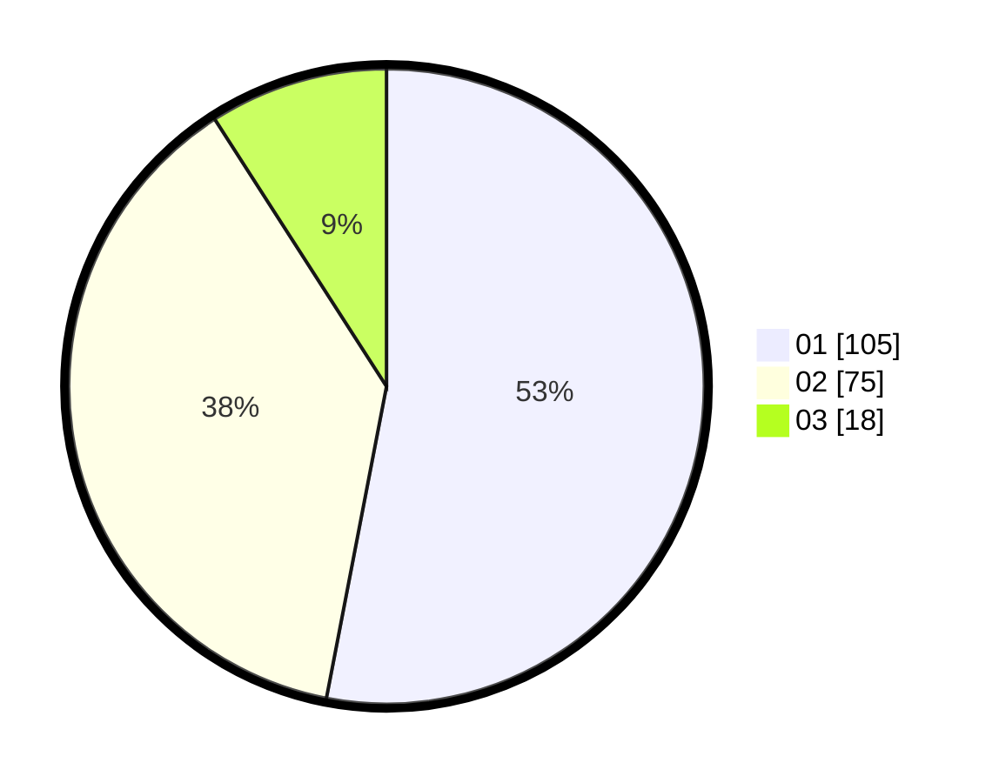

# Hasil

Hasil perolehan suara paslon dapat dilihat pada file paslon-01.txt, paslon-02.txt, dan paslon-03.txt.

Jika tidak ada, artinya data tersebut belum ada pada SIREKAP.

## Perolehan Suara

 * Paslon 01: **105**.
 * Paslon 02: **75**.
 * Paslon 03: **18**.

## Foto C Plano

https://sirekap-obj-formc.kpu.go.id/50ce/pemilu/ppwp/31/71/04/10/03/3171041003070-20240215-000501--ca1128b8-ba78-4f7c-a9e9-1a4149e0fec3.jpg

https://sirekap-obj-formc.kpu.go.id/50ce/pemilu/ppwp/31/71/04/10/03/3171041003070-20240215-000548--19e26c16-6bbd-40ca-b465-688ab62745fc.jpg
