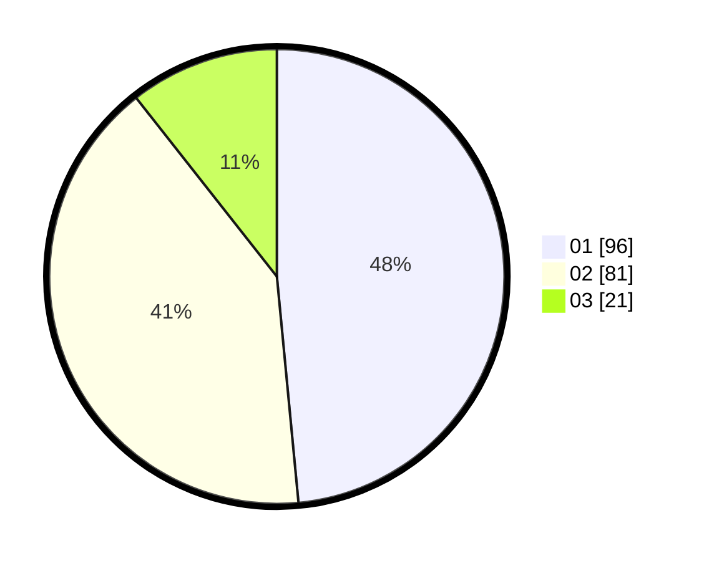

# Hasil

Hasil perolehan suara paslon dapat dilihat pada file paslon-01.txt, paslon-02.txt, dan paslon-03.txt.

Jika tidak ada, artinya data tersebut belum ada pada SIREKAP.

## Perolehan Suara

 * Paslon 01: **96**.
 * Paslon 02: **81**.
 * Paslon 03: **21**.

## Foto C Plano

https://sirekap-obj-formc.kpu.go.id/707b/pemilu/ppwp/31/71/04/10/03/3171041003073-20240214-215527--761e286e-a223-4562-be85-5185b09dc340.jpg

https://sirekap-obj-formc.kpu.go.id/707b/pemilu/ppwp/31/71/04/10/03/3171041003073-20240214-215739--091bd529-aa29-4c53-9336-7831a89dd952.jpg

https://sirekap-obj-formc.kpu.go.id/707b/pemilu/ppwp/31/71/04/10/03/3171041003073-20240214-215900--57dc79cf-6fa3-4d98-9f52-a4e85fa7359e.jpg

## DATA PEMILIH TETAP

Jumlah pemilih dalam DPT: **272**.
 * L: **127**.
 * P: **145**.

## DATA PENGGUNA HAK PILIH

Jumlah pengguna hak pilih dalam DPT: **199**.
 * L: **93**.
 * P: **106**.

Jumlah pengguna hak pilih dalam DPTb: **2**.
 * L: **0**.
 * P: **2**.

Jumlah pengguna hak pilih dalam DPK: **1**.
 * L: **1**.
 * P: **0**.

Jumlah pengguna hak pilih: **202**.
 * L: **94**.
 * P: **108**.

## JUMLAH SUARA SAH DAN TIDAK SAH

JUMLAH SELURUH SUARA SAH: **198**.

JUMLAH SUARA TIDAK SAH: **4**.

JUMLAH SELURUH SUARA SAH DAN SUARA TIDAK SAH: **202**.
