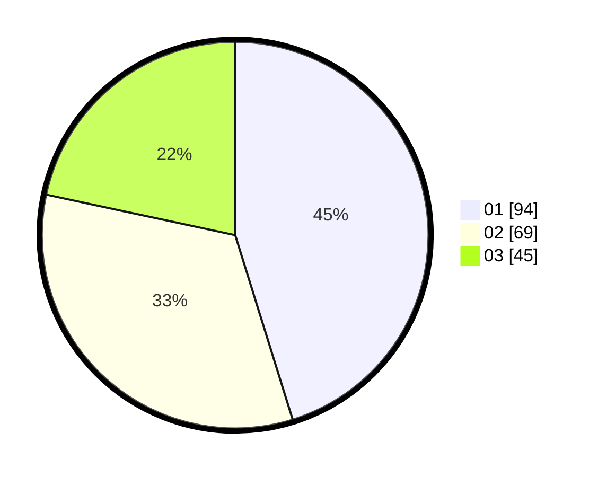

# Hasil

Hasil perolehan suara paslon dapat dilihat pada file paslon-01.txt, paslon-02.txt, dan paslon-03.txt.

Jika tidak ada, artinya data tersebut belum ada pada SIREKAP.

## Perolehan Suara

 * Paslon 01: **94**.
 * Paslon 02: **69**.
 * Paslon 03: **45**.

## Foto C Plano

https://sirekap-obj-formc.kpu.go.id/1b56/pemilu/ppwp/31/71/04/10/03/3171041003079-20240214-194005--31927709-6cb9-4610-ae03-e75b7a35c3e6.jpg

https://sirekap-obj-formc.kpu.go.id/1b56/pemilu/ppwp/31/71/04/10/03/3171041003079-20240214-194751--7c972c54-0891-4342-a7c1-a880bea48b59.jpg

https://sirekap-obj-formc.kpu.go.id/1b56/pemilu/ppwp/31/71/04/10/03/3171041003079-20240214-193709--b533e9c2-24b0-4e8b-bbef-be433dea80da.jpg
