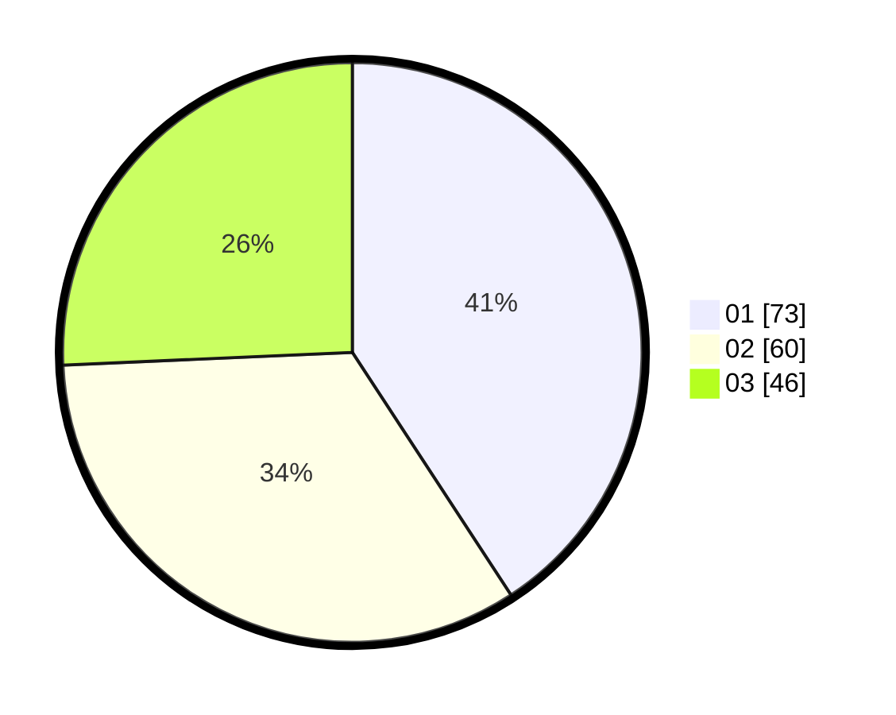

# Hasil

Hasil perolehan suara paslon dapat dilihat pada file paslon-01.txt, paslon-02.txt, dan paslon-03.txt.

Jika tidak ada, artinya data tersebut belum ada pada SIREKAP.

## Perolehan Suara

 * Paslon 01: **73**.
 * Paslon 02: **60**.
 * Paslon 03: **46**.

## Foto C Plano

https://sirekap-obj-formc.kpu.go.id/c436/pemilu/ppwp/31/71/04/10/03/3171041003080-20240215-125036--36a681f4-9e42-401f-8e5b-61d212f49484.jpg

https://sirekap-obj-formc.kpu.go.id/c436/pemilu/ppwp/31/71/04/10/03/3171041003080-20240215-125233--54ccdce1-4fac-4fca-9b9d-43c59181526f.jpg

https://sirekap-obj-formc.kpu.go.id/c436/pemilu/ppwp/31/71/04/10/03/3171041003080-20240215-125327--7c5028fd-b501-43f2-aa5e-8ed382e88473.jpg

## DATA PEMILIH TETAP

Jumlah pemilih dalam DPT: **243**.
 * L: **113**.
 * P: **130**.

## DATA PENGGUNA HAK PILIH

Jumlah pengguna hak pilih dalam DPT: **152**.
 * L: **68**.
 * P: **84**.

Jumlah pengguna hak pilih dalam DPTb: **18**.
 * L: **6**.
 * P: **12**.

Jumlah pengguna hak pilih dalam DPK: **11**.
 * L: **2**.
 * P: **9**.

Jumlah pengguna hak pilih: **181**.
 * L: **76**.
 * P: **105**.

## JUMLAH SUARA SAH DAN TIDAK SAH

JUMLAH SELURUH SUARA SAH: **179**.

JUMLAH SUARA TIDAK SAH: **2**.

JUMLAH SELURUH SUARA SAH DAN SUARA TIDAK SAH: **181**.
