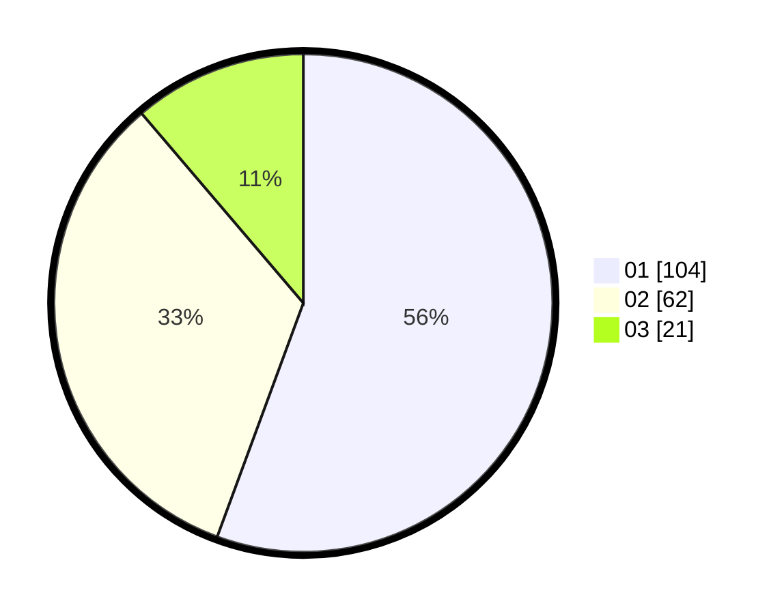

# Hasil

Hasil perolehan suara paslon dapat dilihat pada file paslon-01.txt, paslon-02.txt, dan paslon-03.txt.

Jika tidak ada, artinya data tersebut belum ada pada SIREKAP.

## Perolehan Suara

 * Paslon 01: **104**.
 * Paslon 02: **62**.
 * Paslon 03: **21**.

## Foto C Plano

https://sirekap-obj-formc.kpu.go.id/edb5/pemilu/ppwp/31/71/04/10/04/3171041004003-20240214-160124--791570b7-3ce0-4a00-b3c3-3213beb6f0b2.jpg

https://sirekap-obj-formc.kpu.go.id/edb5/pemilu/ppwp/31/71/04/10/04/3171041004003-20240215-001829--f030d11c-ac58-46c0-b0af-777c158672b4.jpg

https://sirekap-obj-formc.kpu.go.id/edb5/pemilu/ppwp/31/71/04/10/04/3171041004003-20240214-155537--36b42576-d1fc-47e1-8093-7b8b68d8b084.jpg

## DATA PEMILIH TETAP

Jumlah pemilih dalam DPT: **278**.
 * L: **144**.
 * P: **134**.

## DATA PENGGUNA HAK PILIH

Jumlah pengguna hak pilih dalam DPT: **181**.
 * L: **96**.
 * P: **85**.

Jumlah pengguna hak pilih dalam DPTb: **5**.
 * L: **4**.
 * P: **1**.

Jumlah pengguna hak pilih dalam DPK: **4**.
 * L: **2**.
 * P: **2**.

Jumlah pengguna hak pilih: **190**.
 * L: **102**.
 * P: **88**.

## JUMLAH SUARA SAH DAN TIDAK SAH

JUMLAH SELURUH SUARA SAH: **187**.

JUMLAH SUARA TIDAK SAH: **3**.

JUMLAH SELURUH SUARA SAH DAN SUARA TIDAK SAH: **190**.
