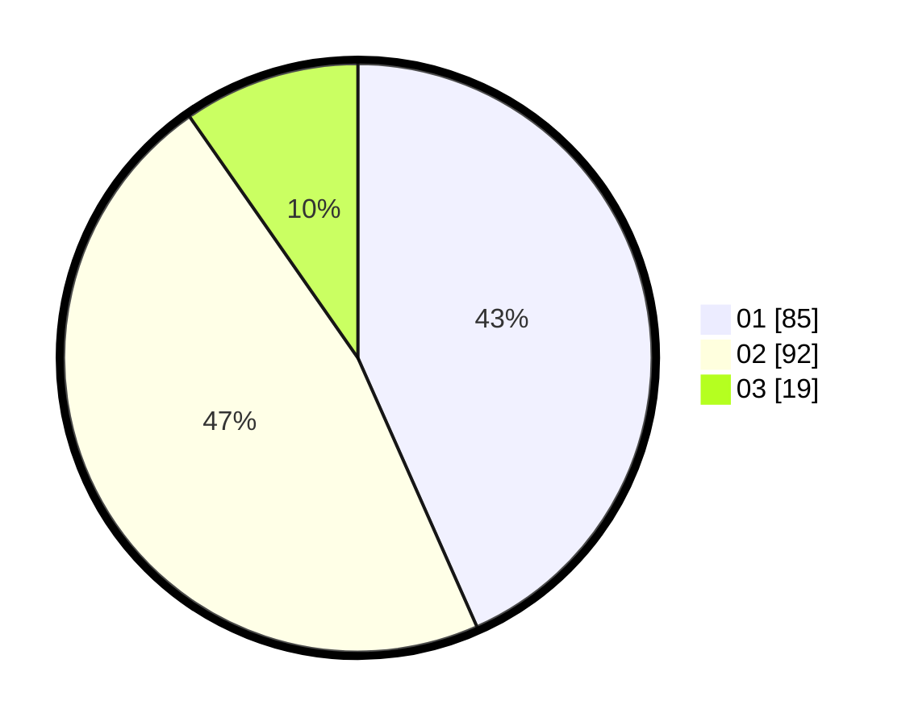

# Hasil

Hasil perolehan suara paslon dapat dilihat pada file paslon-01.txt, paslon-02.txt, dan paslon-03.txt.

Jika tidak ada, artinya data tersebut belum ada pada SIREKAP.

## Perolehan Suara

 * Paslon 01: **85**.
 * Paslon 02: **92**.
 * Paslon 03: **19**.

## Foto C Plano

https://sirekap-obj-formc.kpu.go.id/1457/pemilu/ppwp/31/71/04/10/04/3171041004004-20240218-162630--71f7a0c3-eb24-4570-b4c2-23fd84be44e9.jpg

https://sirekap-obj-formc.kpu.go.id/1457/pemilu/ppwp/31/71/04/10/04/3171041004004-20240214-223819--5ef0b753-eb59-4c1b-8dde-92e2bdedec33.jpg

https://sirekap-obj-formc.kpu.go.id/1457/pemilu/ppwp/31/71/04/10/04/3171041004004-20240214-223941--bb5d3ab1-bbca-4e52-8245-d55c32ed3b63.jpg

## DATA PEMILIH TETAP

Jumlah pemilih dalam DPT: **273**.
 * L: **139**.
 * P: **134**.

## DATA PENGGUNA HAK PILIH

Jumlah pengguna hak pilih dalam DPT: **200**.
 * L: **100**.
 * P: **100**.

Jumlah pengguna hak pilih dalam DPTb: **6**.
 * L: **6**.
 * P: **0**.

Jumlah pengguna hak pilih dalam DPK: **1**.
 * L: **0**.
 * P: **1**.

Jumlah pengguna hak pilih: **207**.
 * L: **106**.
 * P: **101**.

## JUMLAH SUARA SAH DAN TIDAK SAH

JUMLAH SELURUH SUARA SAH: **196**.

JUMLAH SUARA TIDAK SAH: **11**.

JUMLAH SELURUH SUARA SAH DAN SUARA TIDAK SAH: **207**.
