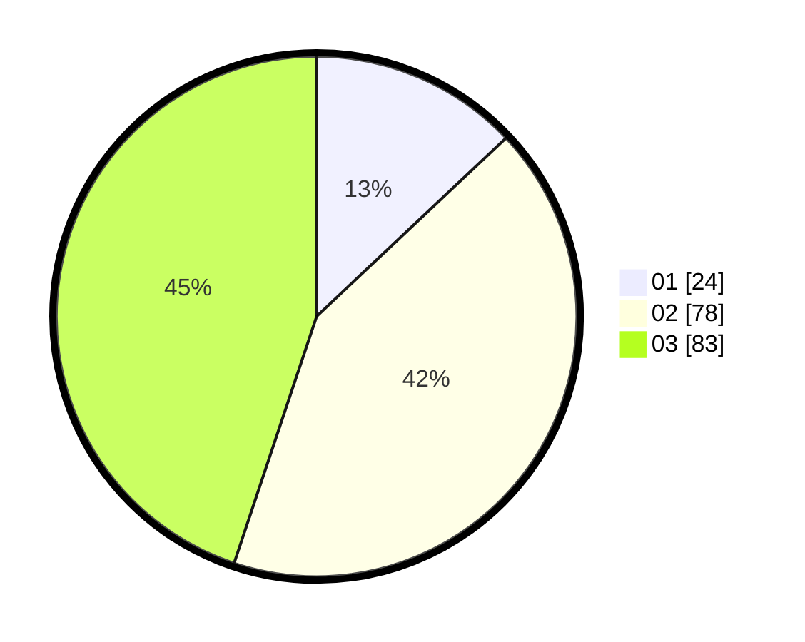

# Hasil

Hasil perolehan suara paslon dapat dilihat pada file paslon-01.txt, paslon-02.txt, dan paslon-03.txt.

Jika tidak ada, artinya data tersebut belum ada pada SIREKAP.

## Perolehan Suara

 * Paslon 01: **24**.
 * Paslon 02: **78**.
 * Paslon 03: **83**.

## Foto C Plano

https://sirekap-obj-formc.kpu.go.id/60bb/pemilu/ppwp/31/71/04/10/04/3171041004008-20240214-204526--937b768f-46f6-4d7f-8d68-f372aa935900.jpg

https://sirekap-obj-formc.kpu.go.id/60bb/pemilu/ppwp/31/71/04/10/04/3171041004008-20240214-204316--73891dff-3777-4c97-b113-a4954b521ff5.jpg

https://sirekap-obj-formc.kpu.go.id/60bb/pemilu/ppwp/31/71/04/10/04/3171041004008-20240214-204809--5a698b98-6421-4958-8479-4751f9250dc9.jpg

## DATA PEMILIH TETAP

Jumlah pemilih dalam DPT: **276**.
 * L: **136**.
 * P: **140**.

## DATA PENGGUNA HAK PILIH

Jumlah pengguna hak pilih dalam DPT: **178**.
 * L: **86**.
 * P: **92**.

Jumlah pengguna hak pilih dalam DPTb: **6**.
 * L: **4**.
 * P: **2**.

Jumlah pengguna hak pilih dalam DPK: **1**.
 * L: **1**.
 * P: **0**.

Jumlah pengguna hak pilih: **185**.
 * L: **91**.
 * P: **94**.

## JUMLAH SUARA SAH DAN TIDAK SAH

JUMLAH SELURUH SUARA SAH: **185**.

JUMLAH SUARA TIDAK SAH: **0**.

JUMLAH SELURUH SUARA SAH DAN SUARA TIDAK SAH: **185**.
