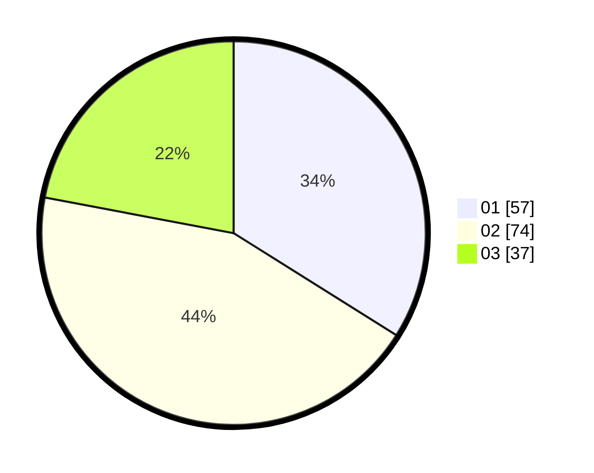

# Hasil

Hasil perolehan suara paslon dapat dilihat pada file paslon-01.txt, paslon-02.txt, dan paslon-03.txt.

Jika tidak ada, artinya data tersebut belum ada pada SIREKAP.

## Perolehan Suara

 * Paslon 01: **57**.
 * Paslon 02: **74**.
 * Paslon 03: **37**.

## Foto C Plano

https://sirekap-obj-formc.kpu.go.id/c992/pemilu/ppwp/31/71/04/10/04/3171041004015-20240218-163639--8a589111-a40a-44f3-8863-a57c8a8c0084.jpg

https://sirekap-obj-formc.kpu.go.id/c992/pemilu/ppwp/31/71/04/10/04/3171041004015-20240218-163857--f42536ee-797d-4c37-99ae-f0d6f4781d20.jpg

https://sirekap-obj-formc.kpu.go.id/c992/pemilu/ppwp/31/71/04/10/04/3171041004015-20240218-163815--e73520ef-a189-494b-bd4b-9c961931cf58.jpg

## DATA PEMILIH TETAP

Jumlah pemilih dalam DPT: **292**.
 * L: **157**.
 * P: **135**.

## DATA PENGGUNA HAK PILIH

Jumlah pengguna hak pilih dalam DPT: **175**.
 * L: **87**.
 * P: **88**.

Jumlah pengguna hak pilih dalam DPTb: **0**.
 * L: **0**.
 * P: **0**.

Jumlah pengguna hak pilih dalam DPK: **0**.
 * L: **0**.
 * P: **0**.

Jumlah pengguna hak pilih: **175**.
 * L: **87**.
 * P: **88**.

## JUMLAH SUARA SAH DAN TIDAK SAH

JUMLAH SELURUH SUARA SAH: **168**.

JUMLAH SUARA TIDAK SAH: **7**.

JUMLAH SELURUH SUARA SAH DAN SUARA TIDAK SAH: **175**.
