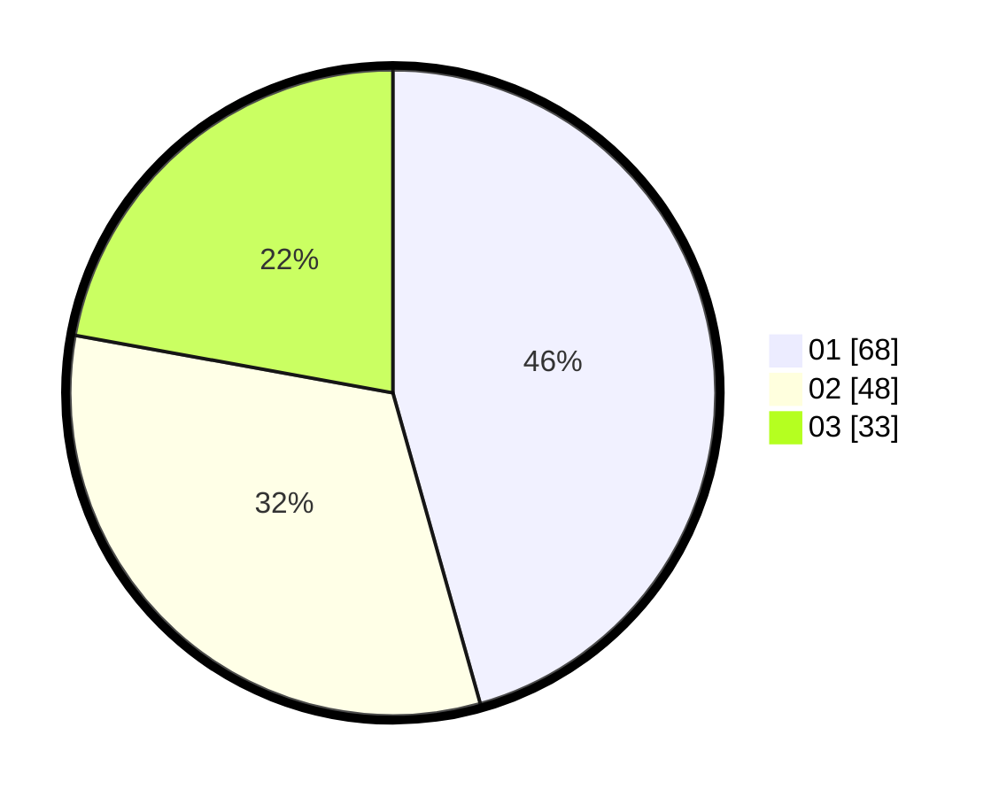

# Hasil

Hasil perolehan suara paslon dapat dilihat pada file paslon-01.txt, paslon-02.txt, dan paslon-03.txt.

Jika tidak ada, artinya data tersebut belum ada pada SIREKAP.

## Perolehan Suara

 * Paslon 01: **68**.
 * Paslon 02: **48**.
 * Paslon 03: **33**.

## Foto C Plano

https://sirekap-obj-formc.kpu.go.id/ad30/pemilu/ppwp/31/71/04/10/04/3171041004026-20240218-175315--5a640938-8d59-412d-948c-cf7e42a57cfa.jpg

https://sirekap-obj-formc.kpu.go.id/ad30/pemilu/ppwp/31/71/04/10/04/3171041004026-20240214-223458--6e330f96-394e-4fe5-bdfa-abb4202b8193.jpg
