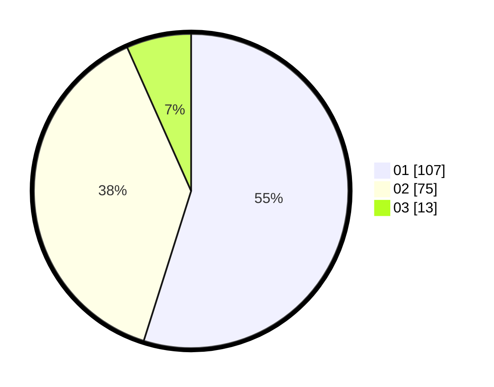

# Hasil

Hasil perolehan suara paslon dapat dilihat pada file paslon-01.txt, paslon-02.txt, dan paslon-03.txt.

Jika tidak ada, artinya data tersebut belum ada pada SIREKAP.

## Perolehan Suara

 * Paslon 01: **107**.
 * Paslon 02: **75**.
 * Paslon 03: **13**.

## Foto C Plano

https://sirekap-obj-formc.kpu.go.id/ed04/pemilu/ppwp/31/71/04/10/04/3171041004030-20240218-172337--535cb29e-ac59-4234-8f29-a59c80f6ae7d.jpg

https://sirekap-obj-formc.kpu.go.id/ed04/pemilu/ppwp/31/71/04/10/04/3171041004030-20240218-183210--a2e6ad4d-d1c4-460d-aefc-11f3b68a7147.jpg

https://sirekap-obj-formc.kpu.go.id/ed04/pemilu/ppwp/31/71/04/10/04/3171041004030-20240218-170604--5ba33c98-c584-4f43-b6fc-b2bf65563b2a.jpg

## DATA PEMILIH TETAP

Jumlah pemilih dalam DPT: **276**.
 * L: **150**.
 * P: **126**.

## DATA PENGGUNA HAK PILIH

Jumlah pengguna hak pilih dalam DPT: **202**.
 * L: **106**.
 * P: **96**.

Jumlah pengguna hak pilih dalam DPTb: **0**.
 * L: **0**.
 * P: **0**.

Jumlah pengguna hak pilih dalam DPK: **0**.
 * L: **0**.
 * P: **0**.

Jumlah pengguna hak pilih: **202**.
 * L: **106**.
 * P: **96**.

## JUMLAH SUARA SAH DAN TIDAK SAH

JUMLAH SELURUH SUARA SAH: **195**.

JUMLAH SUARA TIDAK SAH: **7**.

JUMLAH SELURUH SUARA SAH DAN SUARA TIDAK SAH: **202**.
