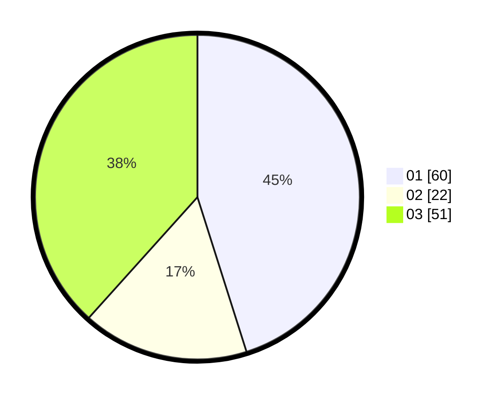

# Hasil

Hasil perolehan suara paslon dapat dilihat pada file paslon-01.txt, paslon-02.txt, dan paslon-03.txt.

Jika tidak ada, artinya data tersebut belum ada pada SIREKAP.

## Perolehan Suara

 * Paslon 01: **60**.
 * Paslon 02: **22**.
 * Paslon 03: **51**.

## Foto C Plano

https://sirekap-obj-formc.kpu.go.id/cf65/pemilu/ppwp/31/71/04/10/04/3171041004035-20240219-161545--99a98e56-979d-4ae5-af03-33838d8e6487.jpg

https://sirekap-obj-formc.kpu.go.id/cf65/pemilu/ppwp/31/71/04/10/04/3171041004035-20240219-143842--e87e3011-20f8-4787-a11b-390f2c963639.jpg

https://sirekap-obj-formc.kpu.go.id/cf65/pemilu/ppwp/31/71/04/10/04/3171041004035-20240219-144131--82239783-49f1-49cd-b6db-05b8ae6f9880.jpg

## DATA PEMILIH TETAP

Jumlah pemilih dalam DPT: **286**.
 * L: **139**.
 * P: **147**.

## DATA PENGGUNA HAK PILIH

Jumlah pengguna hak pilih dalam DPT: **171**.
 * L: **81**.
 * P: **90**.

Jumlah pengguna hak pilih dalam DPTb: **15**.
 * L: **5**.
 * P: **10**.

Jumlah pengguna hak pilih dalam DPK: **4**.
 * L: **1**.
 * P: **3**.

Jumlah pengguna hak pilih: **190**.
 * L: **87**.
 * P: **103**.

## JUMLAH SUARA SAH DAN TIDAK SAH

JUMLAH SELURUH SUARA SAH: **183**.

JUMLAH SUARA TIDAK SAH: **7**.

JUMLAH SELURUH SUARA SAH DAN SUARA TIDAK SAH: **190**.
