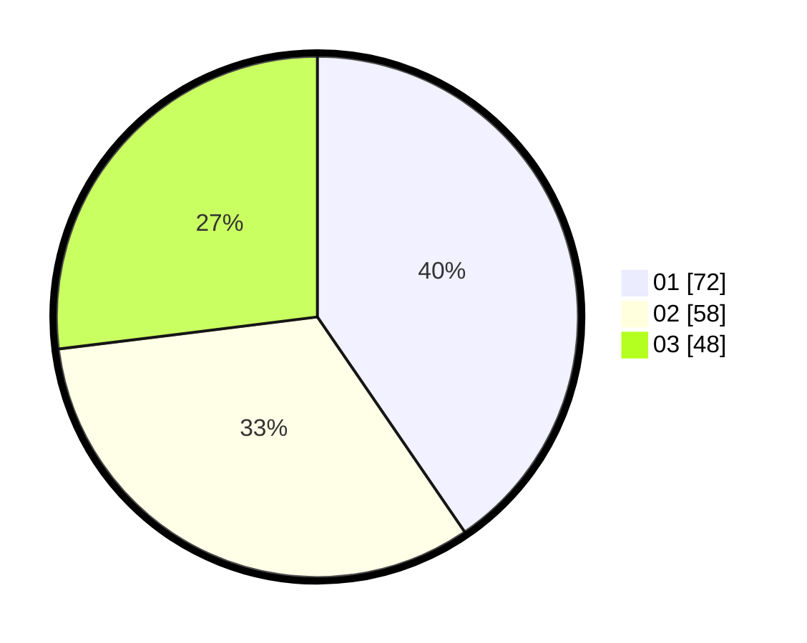

# Hasil

Hasil perolehan suara paslon dapat dilihat pada file paslon-01.txt, paslon-02.txt, dan paslon-03.txt.

Jika tidak ada, artinya data tersebut belum ada pada SIREKAP.

## Perolehan Suara

 * Paslon 01: **72**.
 * Paslon 02: **58**.
 * Paslon 03: **48**.

## Foto C Plano

https://sirekap-obj-formc.kpu.go.id/09ec/pemilu/ppwp/31/71/04/10/04/3171041004036-20240214-224358--57d25a86-e265-4105-b692-102805232b70.jpg

https://sirekap-obj-formc.kpu.go.id/09ec/pemilu/ppwp/31/71/04/10/04/3171041004036-20240214-224842--b5cf3e13-11a1-4914-982f-3fbb06dcf69e.jpg

https://sirekap-obj-formc.kpu.go.id/09ec/pemilu/ppwp/31/71/04/10/04/3171041004036-20240214-225031--fdfd2e96-9611-4f3e-b7b9-d244b123ffda.jpg
