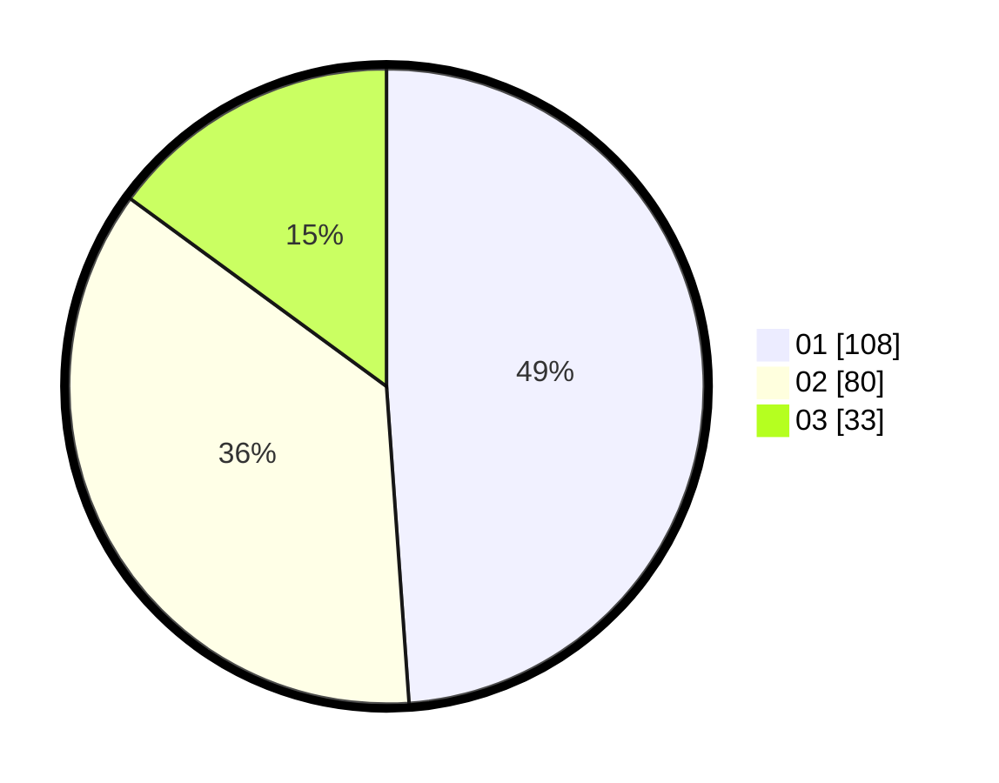

# Hasil

Hasil perolehan suara paslon dapat dilihat pada file paslon-01.txt, paslon-02.txt, dan paslon-03.txt.

Jika tidak ada, artinya data tersebut belum ada pada SIREKAP.

## Perolehan Suara

 * Paslon 01: **108**.
 * Paslon 02: **80**.
 * Paslon 03: **33**.

## Foto C Plano

https://sirekap-obj-formc.kpu.go.id/a7d2/pemilu/ppwp/31/71/04/10/04/3171041004038-20240214-160105--bc36a78b-b2bd-4af4-a198-ceddaf8c97c2.jpg

https://sirekap-obj-formc.kpu.go.id/a7d2/pemilu/ppwp/31/71/04/10/04/3171041004038-20240214-194635--5ea59994-f77e-4b01-828e-b6ad622a1f5b.jpg

https://sirekap-obj-formc.kpu.go.id/a7d2/pemilu/ppwp/31/71/04/10/04/3171041004038-20240214-192005--85446886-ff0b-4aa0-9f0f-3c667f2f2f68.jpg

## DATA PEMILIH TETAP

Jumlah pemilih dalam DPT: **282**.
 * L: **146**.
 * P: **136**.

## DATA PENGGUNA HAK PILIH

Jumlah pengguna hak pilih dalam DPT: **207**.
 * L: **104**.
 * P: **103**.

Jumlah pengguna hak pilih dalam DPTb: **13**.
 * L: **8**.
 * P: **5**.

Jumlah pengguna hak pilih dalam DPK: **7**.
 * L: **1**.
 * P: **6**.

Jumlah pengguna hak pilih: **227**.
 * L: **113**.
 * P: **114**.

## JUMLAH SUARA SAH DAN TIDAK SAH

JUMLAH SELURUH SUARA SAH: **221**.

JUMLAH SUARA TIDAK SAH: **6**.

JUMLAH SELURUH SUARA SAH DAN SUARA TIDAK SAH: **227**.
