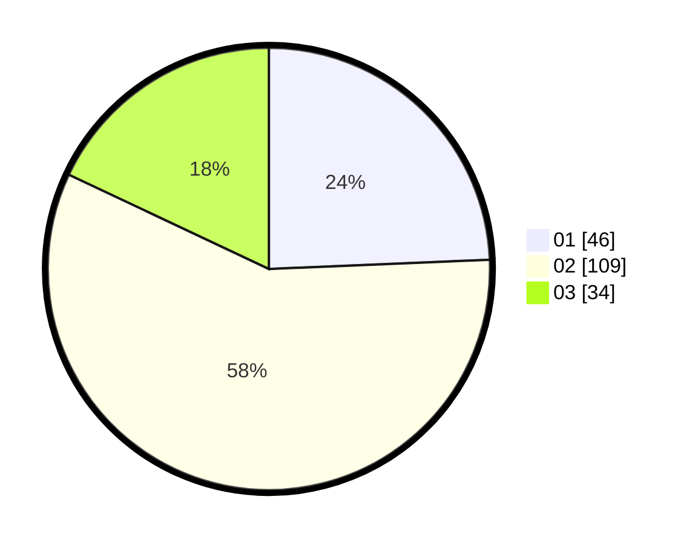

# Hasil

Hasil perolehan suara paslon dapat dilihat pada file paslon-01.txt, paslon-02.txt, dan paslon-03.txt.

Jika tidak ada, artinya data tersebut belum ada pada SIREKAP.

## Perolehan Suara

 * Paslon 01: **46**.
 * Paslon 02: **109**.
 * Paslon 03: **34**.

## Foto C Plano

https://sirekap-obj-formc.kpu.go.id/7873/pemilu/ppwp/31/71/04/10/04/3171041004040-20240218-192056--6316e0be-4df1-4119-9a23-74f31a1c3868.jpg

https://sirekap-obj-formc.kpu.go.id/7873/pemilu/ppwp/31/71/04/10/04/3171041004040-20240214-224718--e0b46bde-3b8e-497f-918a-d3ca1a3394ee.jpg

https://sirekap-obj-formc.kpu.go.id/7873/pemilu/ppwp/31/71/04/10/04/3171041004040-20240214-224719--ac6aa695-13fd-4632-bda4-abe33dd3b558.jpg
