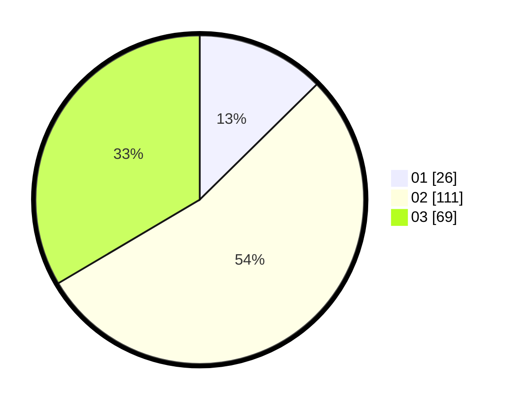

# Hasil

Hasil perolehan suara paslon dapat dilihat pada file paslon-01.txt, paslon-02.txt, dan paslon-03.txt.

Jika tidak ada, artinya data tersebut belum ada pada SIREKAP.

## Perolehan Suara

 * Paslon 01: **26**.
 * Paslon 02: **111**.
 * Paslon 03: **69**.

## Foto C Plano

https://sirekap-obj-formc.kpu.go.id/f518/pemilu/ppwp/31/71/04/10/04/3171041004046-20240214-155713--a79b932a-63b4-4705-9212-345cb179028d.jpg

https://sirekap-obj-formc.kpu.go.id/f518/pemilu/ppwp/31/71/04/10/04/3171041004046-20240214-230232--9f8c5121-708b-430b-85ac-6a5fdbc6a1f2.jpg

https://sirekap-obj-formc.kpu.go.id/f518/pemilu/ppwp/31/71/04/10/04/3171041004046-20240214-155621--ace1880f-9ff5-4067-93c8-ba597992c145.jpg

## DATA PEMILIH TETAP

Jumlah pemilih dalam DPT: **274**.
 * L: **142**.
 * P: **132**.

## DATA PENGGUNA HAK PILIH

Jumlah pengguna hak pilih dalam DPT: **203**.
 * L: **101**.
 * P: **102**.

Jumlah pengguna hak pilih dalam DPTb: **3**.
 * L: **1**.
 * P: **2**.

Jumlah pengguna hak pilih dalam DPK: **1**.
 * L: **1**.
 * P: **0**.

Jumlah pengguna hak pilih: **207**.
 * L: **103**.
 * P: **104**.

## JUMLAH SUARA SAH DAN TIDAK SAH

JUMLAH SELURUH SUARA SAH: **206**.

JUMLAH SUARA TIDAK SAH: **1**.

JUMLAH SELURUH SUARA SAH DAN SUARA TIDAK SAH: **207**.
