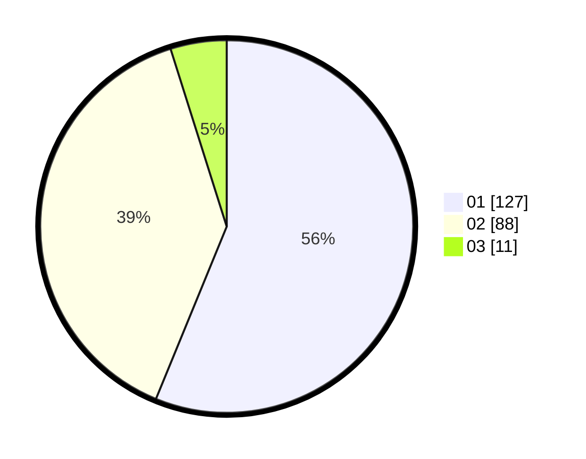

# Hasil

Hasil perolehan suara paslon dapat dilihat pada file paslon-01.txt, paslon-02.txt, dan paslon-03.txt.

Jika tidak ada, artinya data tersebut belum ada pada SIREKAP.

## Perolehan Suara

 * Paslon 01: **127**.
 * Paslon 02: **88**.
 * Paslon 03: **11**.

## Foto C Plano

https://sirekap-obj-formc.kpu.go.id/1426/pemilu/ppwp/31/71/04/10/04/3171041004055-20240214-190842--53252b0f-3ecb-4f08-a24e-9d2ca59e563b.jpg

https://sirekap-obj-formc.kpu.go.id/1426/pemilu/ppwp/31/71/04/10/04/3171041004055-20240214-191315--cb2ee762-6e4e-4258-89cd-1efee3e89999.jpg

https://sirekap-obj-formc.kpu.go.id/1426/pemilu/ppwp/31/71/04/10/04/3171041004055-20240214-190824--9891c87c-c577-4011-8617-0ad0432e9cd5.jpg
