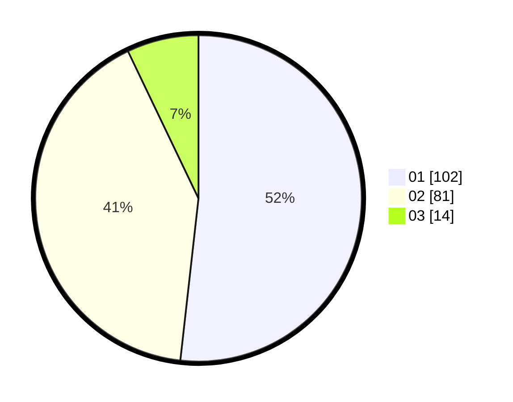

# Hasil

Hasil perolehan suara paslon dapat dilihat pada file paslon-01.txt, paslon-02.txt, dan paslon-03.txt.

Jika tidak ada, artinya data tersebut belum ada pada SIREKAP.

## Perolehan Suara

 * Paslon 01: **102**.
 * Paslon 02: **81**.
 * Paslon 03: **14**.

## Foto C Plano

https://sirekap-obj-formc.kpu.go.id/bb41/pemilu/ppwp/31/71/04/10/04/3171041004067-20240216-054802--0698b02d-e7f5-4dd4-979a-10453728bde0.jpg

https://sirekap-obj-formc.kpu.go.id/bb41/pemilu/ppwp/31/71/04/10/04/3171041004067-20240216-054804--66a16cee-d529-44e8-b5ef-fa2fd7b55d5a.jpg

https://sirekap-obj-formc.kpu.go.id/bb41/pemilu/ppwp/31/71/04/10/04/3171041004067-20240216-054802--bfb249fe-1e28-4de5-9716-bd87b2bb7d16.jpg

## DATA PEMILIH TETAP

Jumlah pemilih dalam DPT: **251**.
 * L: **118**.
 * P: **133**.

## DATA PENGGUNA HAK PILIH

Jumlah pengguna hak pilih dalam DPT: **199**.
 * L: **91**.
 * P: **108**.

Jumlah pengguna hak pilih dalam DPTb: **4**.
 * L: **1**.
 * P: **3**.

Jumlah pengguna hak pilih dalam DPK: **1**.
 * L: **1**.
 * P: **0**.

Jumlah pengguna hak pilih: **204**.
 * L: **93**.
 * P: **111**.

## JUMLAH SUARA SAH DAN TIDAK SAH

JUMLAH SELURUH SUARA SAH: **197**.

JUMLAH SUARA TIDAK SAH: **7**.

JUMLAH SELURUH SUARA SAH DAN SUARA TIDAK SAH: **204**.
