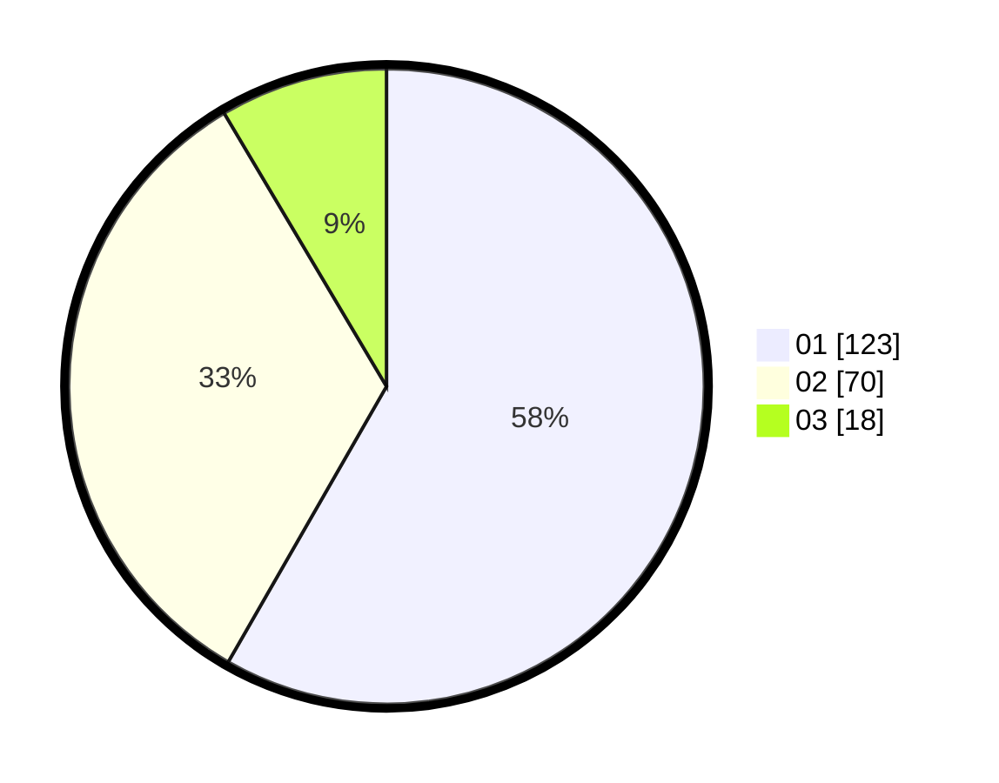

# Hasil

Hasil perolehan suara paslon dapat dilihat pada file paslon-01.txt, paslon-02.txt, dan paslon-03.txt.

Jika tidak ada, artinya data tersebut belum ada pada SIREKAP.

## Perolehan Suara

 * Paslon 01: **123**.
 * Paslon 02: **70**.
 * Paslon 03: **18**.

## Foto C Plano

https://sirekap-obj-formc.kpu.go.id/4855/pemilu/ppwp/31/71/04/10/04/3171041004069-20240215-001343--5879a670-7344-4abb-966e-eead850b92b2.jpg

https://sirekap-obj-formc.kpu.go.id/4855/pemilu/ppwp/31/71/04/10/04/3171041004069-20240214-233532--7cce770f-a264-4408-8eaf-afc20ffb276a.jpg

https://sirekap-obj-formc.kpu.go.id/4855/pemilu/ppwp/31/71/04/10/04/3171041004069-20240214-233825--b5dea627-6d15-4a30-ad5c-3ed1d17441f5.jpg
