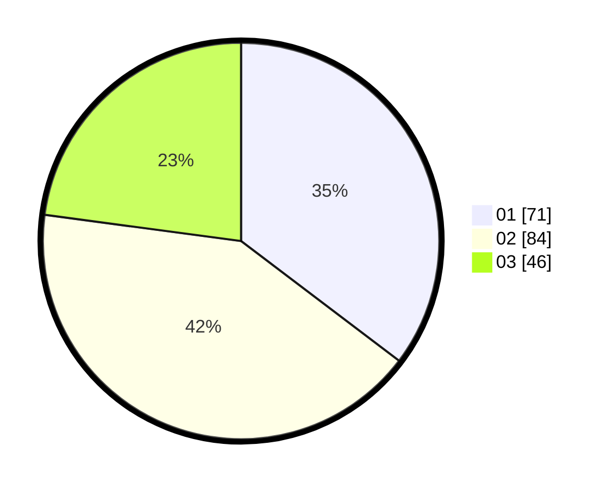

# Hasil

Hasil perolehan suara paslon dapat dilihat pada file paslon-01.txt, paslon-02.txt, dan paslon-03.txt.

Jika tidak ada, artinya data tersebut belum ada pada SIREKAP.

## Perolehan Suara

 * Paslon 01: **71**.
 * Paslon 02: **84**.
 * Paslon 03: **46**.

## Foto C Plano

https://sirekap-obj-formc.kpu.go.id/188e/pemilu/ppwp/31/71/04/10/04/3171041004078-20240214-235010--6d8a0754-cb3c-4d90-a66c-7f3d5cd21746.jpg

https://sirekap-obj-formc.kpu.go.id/188e/pemilu/ppwp/31/71/04/10/04/3171041004078-20240214-235132--0310b66a-6950-41c3-bfe8-0a53913018cb.jpg

https://sirekap-obj-formc.kpu.go.id/188e/pemilu/ppwp/31/71/04/10/04/3171041004078-20240214-235322--b64cc7bf-bb8b-4737-81ef-73676ff977f4.jpg
