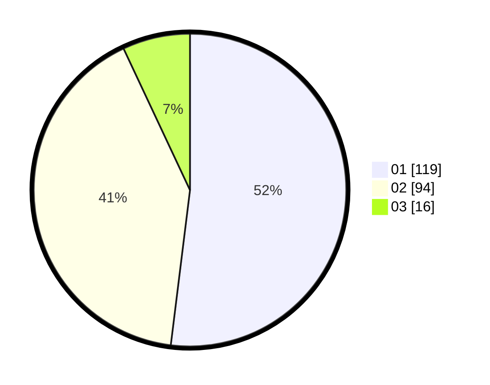

# Hasil

Hasil perolehan suara paslon dapat dilihat pada file paslon-01.txt, paslon-02.txt, dan paslon-03.txt.

Jika tidak ada, artinya data tersebut belum ada pada SIREKAP.

## Perolehan Suara

 * Paslon 01: **119**.
 * Paslon 02: **94**.
 * Paslon 03: **16**.

## Foto C Plano

https://sirekap-obj-formc.kpu.go.id/76e9/pemilu/ppwp/31/71/04/10/05/3171041005002-20240214-205114--f8cfc107-082e-45c7-8181-68570e2bdd51.jpg

https://sirekap-obj-formc.kpu.go.id/76e9/pemilu/ppwp/31/71/04/10/05/3171041005002-20240214-224506--e685f47d-25f0-4495-a12e-8fd535560edb.jpg

https://sirekap-obj-formc.kpu.go.id/76e9/pemilu/ppwp/31/71/04/10/05/3171041005002-20240214-205327--bbc8f429-ba56-4e57-831c-506a66f16d3a.jpg

## DATA PEMILIH TETAP

Jumlah pemilih dalam DPT: **290**.
 * L: **132**.
 * P: **158**.

## DATA PENGGUNA HAK PILIH

Jumlah pengguna hak pilih dalam DPT: **216**.
 * L: **98**.
 * P: **118**.

Jumlah pengguna hak pilih dalam DPTb: **15**.
 * L: **2**.
 * P: **13**.

Jumlah pengguna hak pilih dalam DPK: **2**.
 * L: **1**.
 * P: **1**.

Jumlah pengguna hak pilih: **233**.
 * L: **101**.
 * P: **122**.

## JUMLAH SUARA SAH DAN TIDAK SAH

JUMLAH SELURUH SUARA SAH: **229**.

JUMLAH SUARA TIDAK SAH: **4**.

JUMLAH SELURUH SUARA SAH DAN SUARA TIDAK SAH: **233**.
