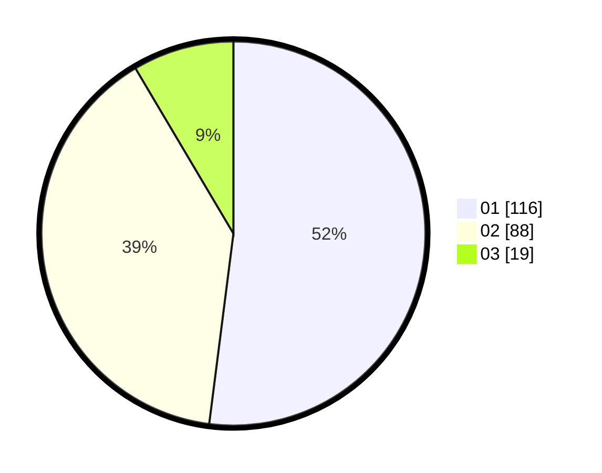

# Hasil

Hasil perolehan suara paslon dapat dilihat pada file paslon-01.txt, paslon-02.txt, dan paslon-03.txt.

Jika tidak ada, artinya data tersebut belum ada pada SIREKAP.

## Perolehan Suara

 * Paslon 01: **116**.
 * Paslon 02: **88**.
 * Paslon 03: **19**.

## Foto C Plano

https://sirekap-obj-formc.kpu.go.id/2ffa/pemilu/ppwp/31/71/04/10/05/3171041005003-20240215-195106--9c5e134c-3a68-42bc-b786-a4c2eb5af238.jpg

https://sirekap-obj-formc.kpu.go.id/2ffa/pemilu/ppwp/31/71/04/10/05/3171041005003-20240215-195214--e35f9044-bfc4-4e8d-844b-257e4003fdef.jpg

https://sirekap-obj-formc.kpu.go.id/2ffa/pemilu/ppwp/31/71/04/10/05/3171041005003-20240215-195336--781071b8-249b-4839-8f86-c6beb66edbc5.jpg

## DATA PEMILIH TETAP

Jumlah pemilih dalam DPT: **289**.
 * L: **139**.
 * P: **150**.

## DATA PENGGUNA HAK PILIH

Jumlah pengguna hak pilih dalam DPT: **218**.
 * L: **105**.
 * P: **113**.

Jumlah pengguna hak pilih dalam DPTb: **8**.
 * L: **4**.
 * P: **4**.

Jumlah pengguna hak pilih dalam DPK: **1**.
 * L: **0**.
 * P: **1**.

Jumlah pengguna hak pilih: **227**.
 * L: **109**.
 * P: **118**.

## JUMLAH SUARA SAH DAN TIDAK SAH

JUMLAH SELURUH SUARA SAH: **223**.

JUMLAH SUARA TIDAK SAH: **0**.

JUMLAH SELURUH SUARA SAH DAN SUARA TIDAK SAH: **223**.
