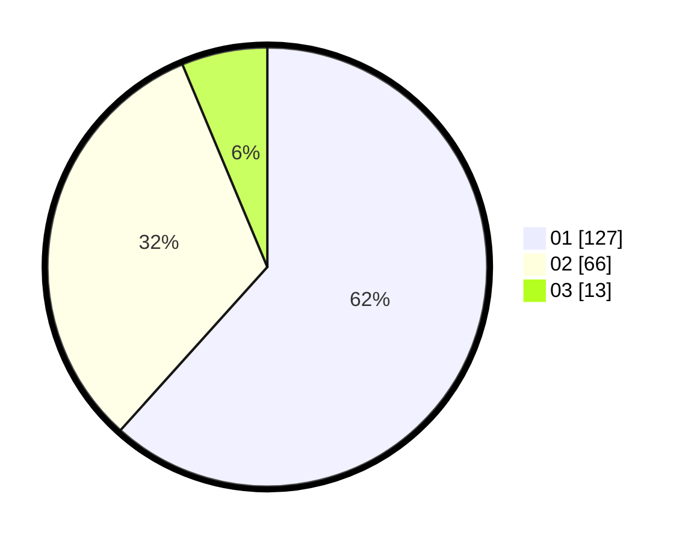

# Hasil

Hasil perolehan suara paslon dapat dilihat pada file paslon-01.txt, paslon-02.txt, dan paslon-03.txt.

Jika tidak ada, artinya data tersebut belum ada pada SIREKAP.

## Perolehan Suara

 * Paslon 01: **127**.
 * Paslon 02: **66**.
 * Paslon 03: **13**.

## Foto C Plano

https://sirekap-obj-formc.kpu.go.id/0e2b/pemilu/ppwp/31/71/04/10/05/3171041005011-20240217-111814--fea1ccf0-e79b-4414-8e79-4da5546fcc8b.jpg

https://sirekap-obj-formc.kpu.go.id/0e2b/pemilu/ppwp/31/71/04/10/05/3171041005011-20240218-074851--fb438f15-751f-4c3d-9a74-5ae4c2406835.jpg

https://sirekap-obj-formc.kpu.go.id/0e2b/pemilu/ppwp/31/71/04/10/05/3171041005011-20240217-203002--79b6b9c2-1b2c-4c44-a1c2-ee92b8580da0.jpg

## DATA PEMILIH TETAP

Jumlah pemilih dalam DPT: **262**.
 * L: **127**.
 * P: **135**.

## DATA PENGGUNA HAK PILIH

Jumlah pengguna hak pilih dalam DPT: **195**.
 * L: **97**.
 * P: **98**.

Jumlah pengguna hak pilih dalam DPTb: **11**.
 * L: **4**.
 * P: **7**.

Jumlah pengguna hak pilih dalam DPK: **2**.
 * L: **0**.
 * P: **2**.

Jumlah pengguna hak pilih: **208**.
 * L: **101**.
 * P: **107**.

## JUMLAH SUARA SAH DAN TIDAK SAH

JUMLAH SELURUH SUARA SAH: **206**.

JUMLAH SUARA TIDAK SAH: **2**.

JUMLAH SELURUH SUARA SAH DAN SUARA TIDAK SAH: **208**.
