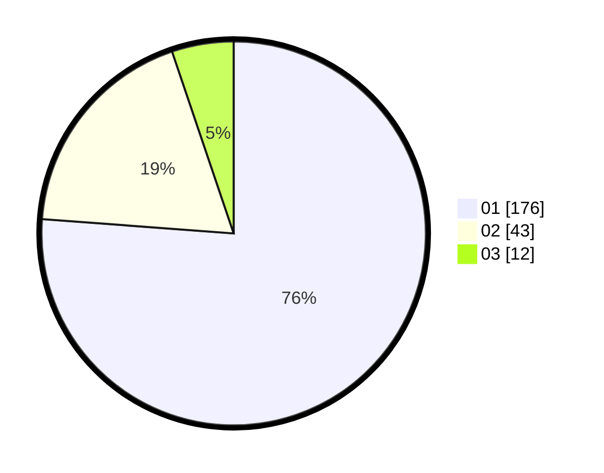

# Hasil

Hasil perolehan suara paslon dapat dilihat pada file paslon-01.txt, paslon-02.txt, dan paslon-03.txt.

Jika tidak ada, artinya data tersebut belum ada pada SIREKAP.

## Perolehan Suara

 * Paslon 01: **176**.
 * Paslon 02: **43**.
 * Paslon 03: **12**.

## Foto C Plano

https://sirekap-obj-formc.kpu.go.id/e5cd/pemilu/ppwp/31/71/04/10/05/3171041005014-20240215-003716--5664ebd9-9595-4374-bf80-ffcb86dde122.jpg

https://sirekap-obj-formc.kpu.go.id/e5cd/pemilu/ppwp/31/71/04/10/05/3171041005014-20240215-003812--f468a0f0-f3c7-4fbb-8eee-d75c6895ef01.jpg

https://sirekap-obj-formc.kpu.go.id/e5cd/pemilu/ppwp/31/71/04/10/05/3171041005014-20240215-003845--7f1819e5-b19c-4fe4-9f9d-389211b52b68.jpg
