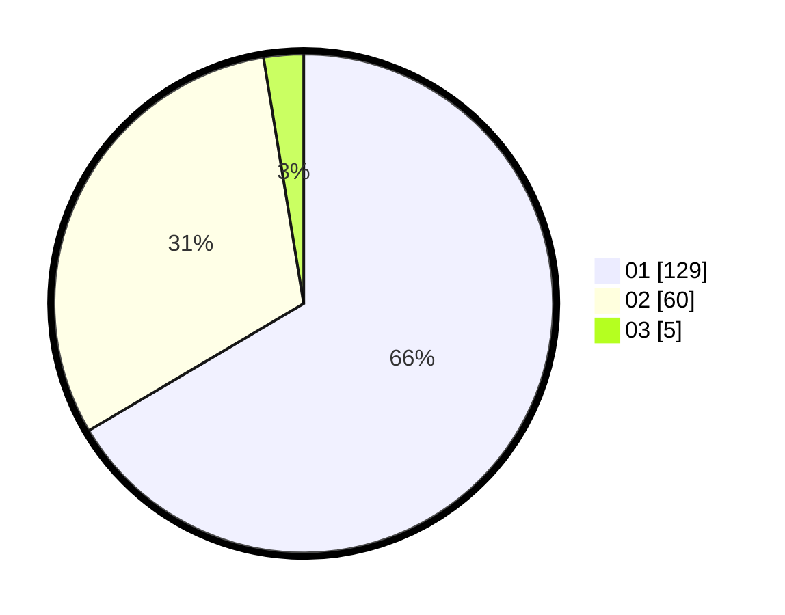

# Hasil

Hasil perolehan suara paslon dapat dilihat pada file paslon-01.txt, paslon-02.txt, dan paslon-03.txt.

Jika tidak ada, artinya data tersebut belum ada pada SIREKAP.

## Perolehan Suara

 * Paslon 01: **129**.
 * Paslon 02: **60**.
 * Paslon 03: **5**.

## Foto C Plano

https://sirekap-obj-formc.kpu.go.id/d850/pemilu/ppwp/31/71/04/10/05/3171041005017-20240214-184631--775be207-5d79-452a-84a4-8903e45c53e4.jpg

https://sirekap-obj-formc.kpu.go.id/d850/pemilu/ppwp/31/71/04/10/05/3171041005017-20240214-184823--85c14889-e4f7-4d91-b1c2-bfab0d8f1a99.jpg

https://sirekap-obj-formc.kpu.go.id/d850/pemilu/ppwp/31/71/04/10/05/3171041005017-20240214-185153--d62e6918-102f-44d2-9839-812bcefe4a1a.jpg

## DATA PEMILIH TETAP

Jumlah pemilih dalam DPT: **190**.
 * L: **104**.
 * P: **86**.

## DATA PENGGUNA HAK PILIH

Jumlah pengguna hak pilih dalam DPT: **190**.
 * L: **104**.
 * P: **86**.

Jumlah pengguna hak pilih dalam DPTb: **2**.
 * L: **1**.
 * P: **1**.

Jumlah pengguna hak pilih dalam DPK: **3**.
 * L: **0**.
 * P: **3**.

Jumlah pengguna hak pilih: **195**.
 * L: **105**.
 * P: **90**.

## JUMLAH SUARA SAH DAN TIDAK SAH

JUMLAH SELURUH SUARA SAH: **194**.

JUMLAH SUARA TIDAK SAH: **1**.

JUMLAH SELURUH SUARA SAH DAN SUARA TIDAK SAH: **195**.
