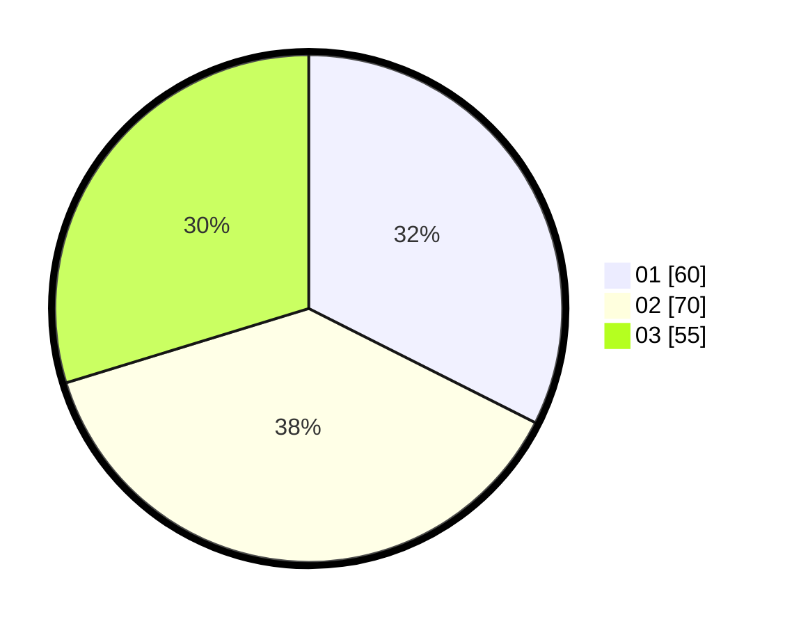

# Hasil

Hasil perolehan suara paslon dapat dilihat pada file paslon-01.txt, paslon-02.txt, dan paslon-03.txt.

Jika tidak ada, artinya data tersebut belum ada pada SIREKAP.

## Perolehan Suara

 * Paslon 01: **60**.
 * Paslon 02: **70**.
 * Paslon 03: **55**.

## Foto C Plano

https://sirekap-obj-formc.kpu.go.id/33af/pemilu/ppwp/31/71/04/10/05/3171041005025-20240214-202642--046aa6a1-0bfd-40f8-a9b6-5872c74ec752.jpg

https://sirekap-obj-formc.kpu.go.id/33af/pemilu/ppwp/31/71/04/10/05/3171041005025-20240214-202658--995be98a-0e97-4ec1-bbdb-83fd8daef32b.jpg

https://sirekap-obj-formc.kpu.go.id/33af/pemilu/ppwp/31/71/04/10/05/3171041005025-20240214-201442--df45b8c9-603e-4595-969a-46c9312eb001.jpg

## DATA PEMILIH TETAP

Jumlah pemilih dalam DPT: **243**.
 * L: **117**.
 * P: **126**.

## DATA PENGGUNA HAK PILIH

Jumlah pengguna hak pilih dalam DPT: **173**.
 * L: **79**.
 * P: **94**.

Jumlah pengguna hak pilih dalam DPTb: **13**.
 * L: **4**.
 * P: **9**.

Jumlah pengguna hak pilih dalam DPK: **3**.
 * L: **3**.
 * P: **0**.

Jumlah pengguna hak pilih: **189**.
 * L: **86**.
 * P: **103**.

## JUMLAH SUARA SAH DAN TIDAK SAH

JUMLAH SELURUH SUARA SAH: **185**.

JUMLAH SUARA TIDAK SAH: **4**.

JUMLAH SELURUH SUARA SAH DAN SUARA TIDAK SAH: **189**.
