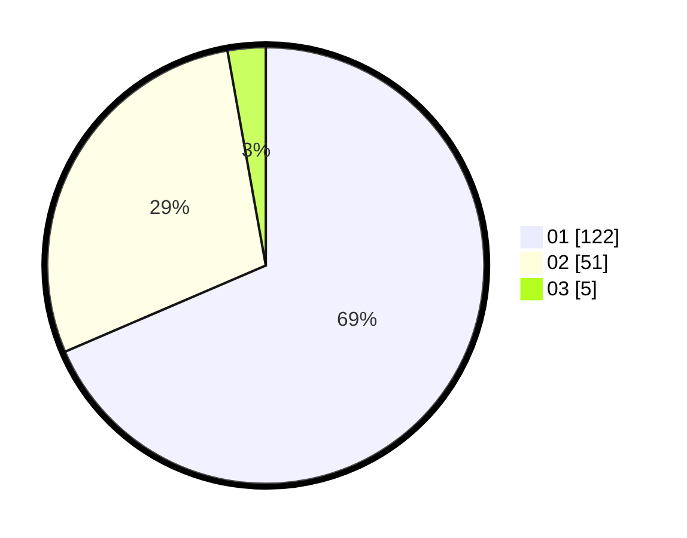

# Hasil

Hasil perolehan suara paslon dapat dilihat pada file paslon-01.txt, paslon-02.txt, dan paslon-03.txt.

Jika tidak ada, artinya data tersebut belum ada pada SIREKAP.

## Perolehan Suara

 * Paslon 01: **122**.
 * Paslon 02: **51**.
 * Paslon 03: **5**.

## Foto C Plano

https://sirekap-obj-formc.kpu.go.id/fadf/pemilu/ppwp/31/71/04/10/05/3171041005038-20240214-221811--c8096408-307e-4c45-82a7-20997d1f0d3f.jpg

https://sirekap-obj-formc.kpu.go.id/fadf/pemilu/ppwp/31/71/04/10/05/3171041005038-20240214-222300--ce7a6151-e66c-49e5-9c41-597adc1ed89d.jpg

https://sirekap-obj-formc.kpu.go.id/fadf/pemilu/ppwp/31/71/04/10/05/3171041005038-20240214-222406--87f3c0c0-03e2-4b0c-96b9-ea84009b0ced.jpg

## DATA PEMILIH TETAP

Jumlah pemilih dalam DPT: **267**.
 * L: **148**.
 * P: **119**.

## DATA PENGGUNA HAK PILIH

Jumlah pengguna hak pilih dalam DPT: **176**.
 * L: **90**.
 * P: **86**.

Jumlah pengguna hak pilih dalam DPTb: **0**.
 * L: **0**.
 * P: **0**.

Jumlah pengguna hak pilih dalam DPK: **5**.
 * L: **3**.
 * P: **2**.

Jumlah pengguna hak pilih: **181**.
 * L: **93**.
 * P: **88**.

## JUMLAH SUARA SAH DAN TIDAK SAH

JUMLAH SELURUH SUARA SAH: **178**.

JUMLAH SUARA TIDAK SAH: **3**.

JUMLAH SELURUH SUARA SAH DAN SUARA TIDAK SAH: **181**.
