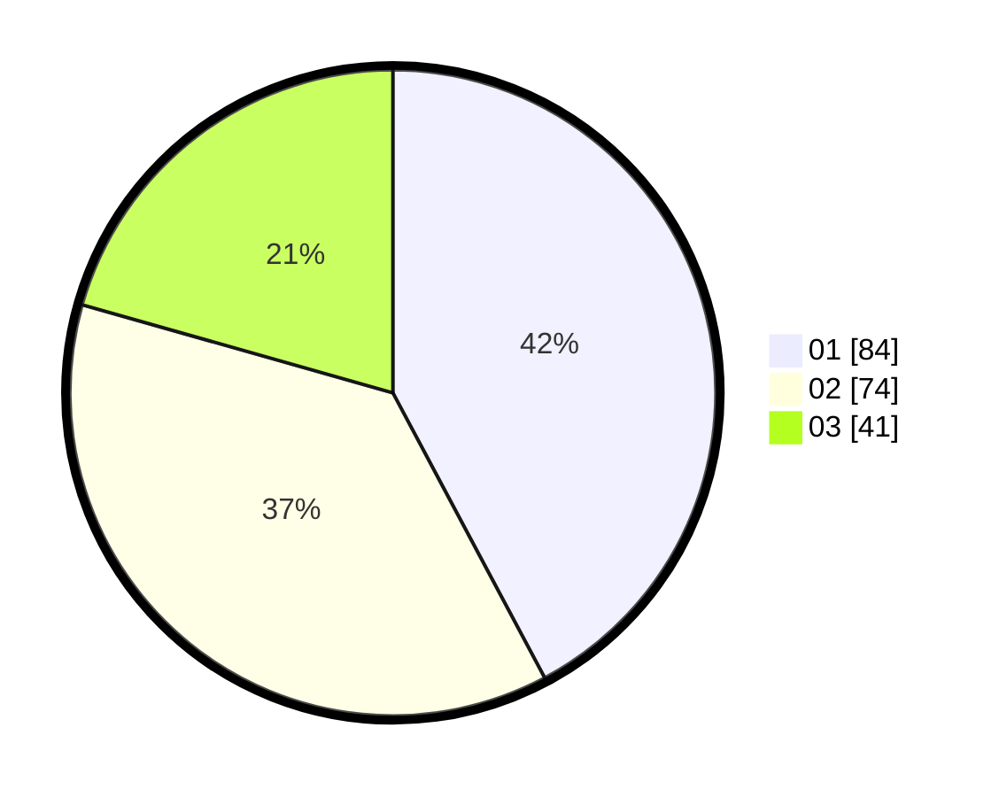

# Hasil

Hasil perolehan suara paslon dapat dilihat pada file paslon-01.txt, paslon-02.txt, dan paslon-03.txt.

Jika tidak ada, artinya data tersebut belum ada pada SIREKAP.

## Perolehan Suara

 * Paslon 01: **84**.
 * Paslon 02: **74**.
 * Paslon 03: **41**.

## Foto C Plano

https://sirekap-obj-formc.kpu.go.id/bff5/pemilu/ppwp/31/71/04/10/05/3171041005048-20240214-234915--ce435df1-a010-43d7-8c15-60a06544a11a.jpg

https://sirekap-obj-formc.kpu.go.id/bff5/pemilu/ppwp/31/71/04/10/05/3171041005048-20240214-185745--08ef976f-e2b7-4339-9be4-80234f180d5c.jpg

https://sirekap-obj-formc.kpu.go.id/bff5/pemilu/ppwp/31/71/04/10/05/3171041005048-20240214-235037--f4d84ce9-248e-4404-9cf5-3c086c746302.jpg

## DATA PEMILIH TETAP

Jumlah pemilih dalam DPT: **250**.
 * L: **130**.
 * P: **120**.

## DATA PENGGUNA HAK PILIH

Jumlah pengguna hak pilih dalam DPT: **199**.
 * L: **100**.
 * P: **99**.

Jumlah pengguna hak pilih dalam DPTb: **7**.
 * L: **3**.
 * P: **4**.

Jumlah pengguna hak pilih dalam DPK: **1**.
 * L: **0**.
 * P: **1**.

Jumlah pengguna hak pilih: **207**.
 * L: **103**.
 * P: **104**.

## JUMLAH SUARA SAH DAN TIDAK SAH

JUMLAH SELURUH SUARA SAH: **199**.

JUMLAH SUARA TIDAK SAH: **8**.

JUMLAH SELURUH SUARA SAH DAN SUARA TIDAK SAH: **207**.
