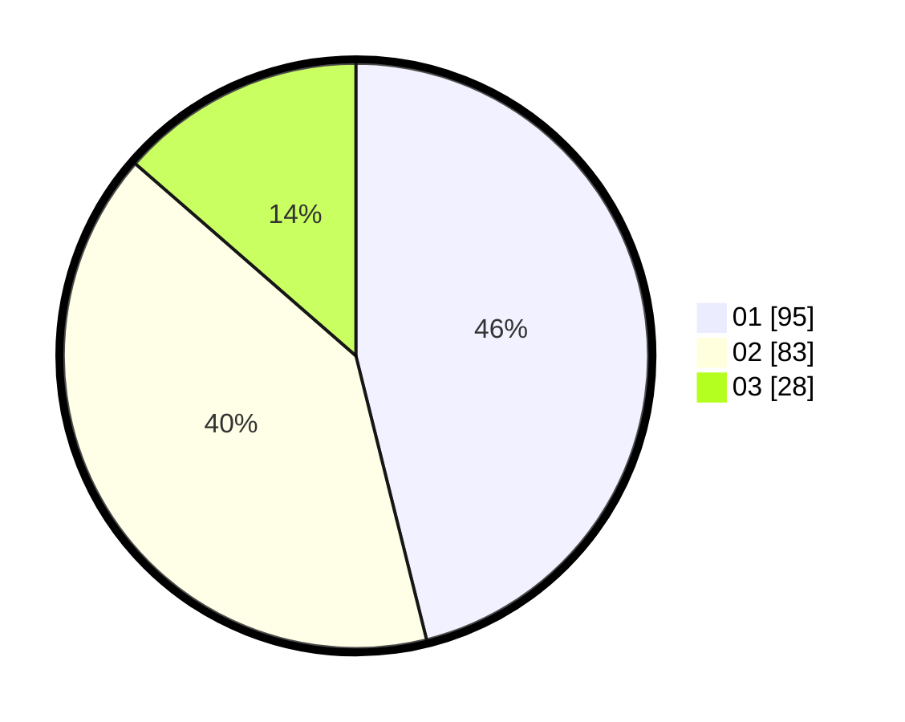

# Hasil

Hasil perolehan suara paslon dapat dilihat pada file paslon-01.txt, paslon-02.txt, dan paslon-03.txt.

Jika tidak ada, artinya data tersebut belum ada pada SIREKAP.

## Perolehan Suara

 * Paslon 01: **95**.
 * Paslon 02: **83**.
 * Paslon 03: **28**.

## Foto C Plano

https://sirekap-obj-formc.kpu.go.id/74d8/pemilu/ppwp/31/71/04/10/05/3171041005052-20240214-185845--7644b971-3685-4fb5-a4c6-7eeab6f00d59.jpg

https://sirekap-obj-formc.kpu.go.id/74d8/pemilu/ppwp/31/71/04/10/05/3171041005052-20240214-185848--1617cff6-a86a-41c4-a7d1-932cb57ddf88.jpg

https://sirekap-obj-formc.kpu.go.id/74d8/pemilu/ppwp/31/71/04/10/05/3171041005052-20240214-185850--fc726be0-904c-4876-bb21-ee1ab87898b0.jpg

## DATA PEMILIH TETAP

Jumlah pemilih dalam DPT: **256**.
 * L: **123**.
 * P: **133**.

## DATA PENGGUNA HAK PILIH

Jumlah pengguna hak pilih dalam DPT: **240**.
 * L: **96**.
 * P: **144**.

Jumlah pengguna hak pilih dalam DPTb: **0**.
 * L: **0**.
 * P: **0**.

Jumlah pengguna hak pilih dalam DPK: **0**.
 * L: **0**.
 * P: **0**.

Jumlah pengguna hak pilih: **240**.
 * L: **96**.
 * P: **144**.

## JUMLAH SUARA SAH DAN TIDAK SAH

JUMLAH SELURUH SUARA SAH: **206**.

JUMLAH SUARA TIDAK SAH: **4**.

JUMLAH SELURUH SUARA SAH DAN SUARA TIDAK SAH: **210**.
