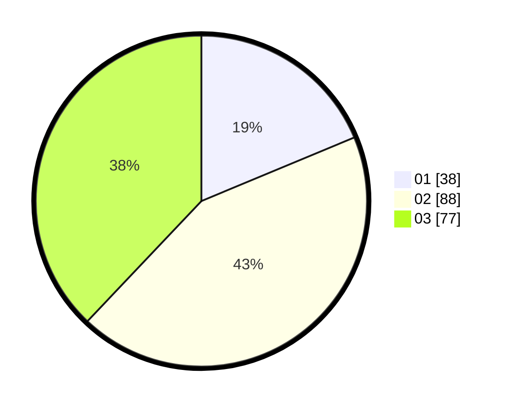

# Hasil

Hasil perolehan suara paslon dapat dilihat pada file paslon-01.txt, paslon-02.txt, dan paslon-03.txt.

Jika tidak ada, artinya data tersebut belum ada pada SIREKAP.

## Perolehan Suara

 * Paslon 01: **38**.
 * Paslon 02: **88**.
 * Paslon 03: **77**.

## Foto C Plano

https://sirekap-obj-formc.kpu.go.id/767e/pemilu/ppwp/31/71/04/10/06/3171041006004-20240214-212500--602b2c01-7da1-4cd2-bedb-2fb61c3703ef.jpg

https://sirekap-obj-formc.kpu.go.id/767e/pemilu/ppwp/31/71/04/10/06/3171041006004-20240214-212552--622a9f37-6d17-47d1-9074-bcbce5afad57.jpg

https://sirekap-obj-formc.kpu.go.id/767e/pemilu/ppwp/31/71/04/10/06/3171041006004-20240214-212647--f0584a28-2f47-46cb-96e9-dc21331036af.jpg

## DATA PEMILIH TETAP

Jumlah pemilih dalam DPT: **203**.
 * L: **91**.
 * P: **112**.

## DATA PENGGUNA HAK PILIH

Jumlah pengguna hak pilih dalam DPT: **203**.
 * L: **91**.
 * P: **112**.

Jumlah pengguna hak pilih dalam DPTb: **2**.
 * L: **1**.
 * P: **1**.

Jumlah pengguna hak pilih dalam DPK: **0**.
 * L: **0**.
 * P: **0**.

Jumlah pengguna hak pilih: **205**.
 * L: **92**.
 * P: **113**.

## JUMLAH SUARA SAH DAN TIDAK SAH

JUMLAH SELURUH SUARA SAH: **203**.

JUMLAH SUARA TIDAK SAH: **2**.

JUMLAH SELURUH SUARA SAH DAN SUARA TIDAK SAH: **205**.
