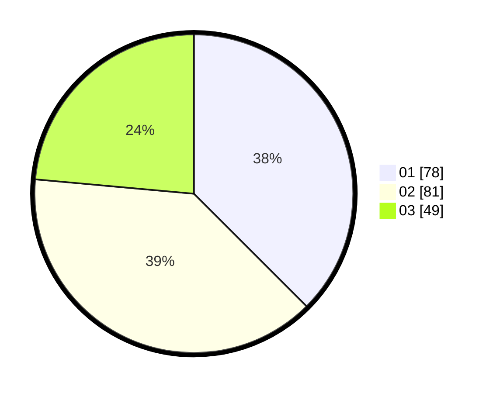

# Hasil

Hasil perolehan suara paslon dapat dilihat pada file paslon-01.txt, paslon-02.txt, dan paslon-03.txt.

Jika tidak ada, artinya data tersebut belum ada pada SIREKAP.

## Perolehan Suara

 * Paslon 01: **78**.
 * Paslon 02: **81**.
 * Paslon 03: **49**.

## Foto C Plano

https://sirekap-obj-formc.kpu.go.id/f305/pemilu/ppwp/31/71/04/10/06/3171041006007-20240217-142728--7b50b310-edda-4e20-aac7-e517adea4b68.jpg

https://sirekap-obj-formc.kpu.go.id/f305/pemilu/ppwp/31/71/04/10/06/3171041006007-20240217-142835--9ca38c6f-3db4-4942-b504-e359b2ef8473.jpg

https://sirekap-obj-formc.kpu.go.id/f305/pemilu/ppwp/31/71/04/10/06/3171041006007-20240217-142921--ab3acc4f-bee6-4345-b6c6-a7e5a07ff4da.jpg

## DATA PEMILIH TETAP

Jumlah pemilih dalam DPT: **205**.
 * L: **94**.
 * P: **111**.

## DATA PENGGUNA HAK PILIH

Jumlah pengguna hak pilih dalam DPT: **205**.
 * L: **94**.
 * P: **111**.

Jumlah pengguna hak pilih dalam DPTb: **1**.
 * L: **0**.
 * P: **1**.

Jumlah pengguna hak pilih dalam DPK: **3**.
 * L: **0**.
 * P: **3**.

Jumlah pengguna hak pilih: **209**.
 * L: **94**.
 * P: **115**.

## JUMLAH SUARA SAH DAN TIDAK SAH

JUMLAH SELURUH SUARA SAH: **208**.

JUMLAH SUARA TIDAK SAH: **1**.

JUMLAH SELURUH SUARA SAH DAN SUARA TIDAK SAH: **209**.
