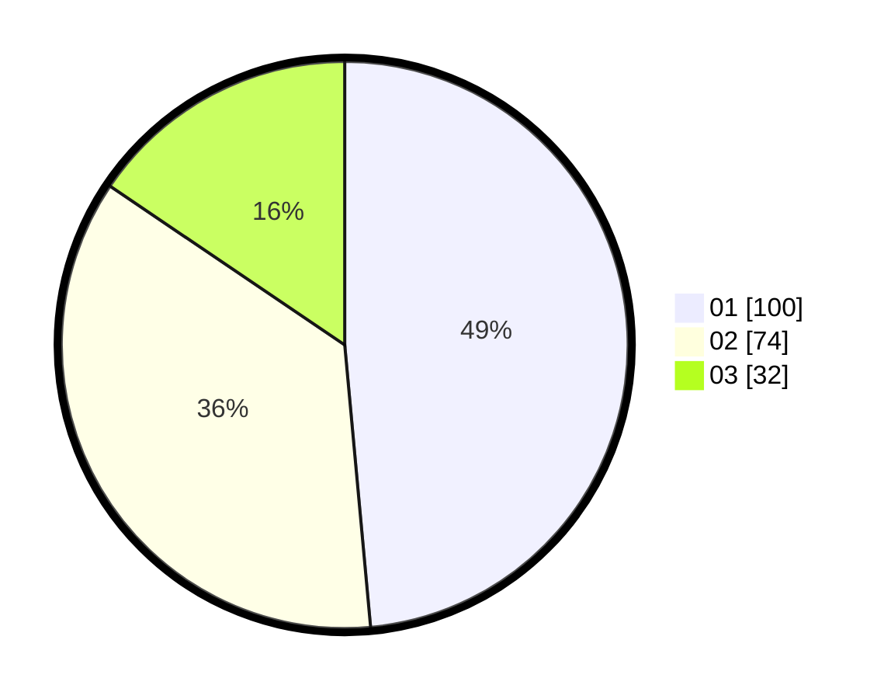

# Hasil

Hasil perolehan suara paslon dapat dilihat pada file paslon-01.txt, paslon-02.txt, dan paslon-03.txt.

Jika tidak ada, artinya data tersebut belum ada pada SIREKAP.

## Perolehan Suara

 * Paslon 01: **100**.
 * Paslon 02: **74**.
 * Paslon 03: **32**.

## Foto C Plano

https://sirekap-obj-formc.kpu.go.id/d4c7/pemilu/ppwp/31/71/04/10/06/3171041006008-20240217-194236--fb00e2ab-541b-4be4-acd8-0a84184e578d.jpg

https://sirekap-obj-formc.kpu.go.id/d4c7/pemilu/ppwp/31/71/04/10/06/3171041006008-20240217-194238--9cf5869b-c049-4caf-86e4-1e0e6fc0a689.jpg

https://sirekap-obj-formc.kpu.go.id/d4c7/pemilu/ppwp/31/71/04/10/06/3171041006008-20240217-194237--8a0e534c-1527-4230-9023-c2405c674eba.jpg

## DATA PEMILIH TETAP

Jumlah pemilih dalam DPT: **267**.
 * L: **136**.
 * P: **131**.

## DATA PENGGUNA HAK PILIH

Jumlah pengguna hak pilih dalam DPT: **208**.
 * L: **103**.
 * P: **105**.

Jumlah pengguna hak pilih dalam DPTb: **4**.
 * L: **2**.
 * P: **2**.

Jumlah pengguna hak pilih dalam DPK: **0**.
 * L: **0**.
 * P: **0**.

Jumlah pengguna hak pilih: **212**.
 * L: **105**.
 * P: **107**.

## JUMLAH SUARA SAH DAN TIDAK SAH

JUMLAH SELURUH SUARA SAH: **206**.

JUMLAH SUARA TIDAK SAH: **6**.

JUMLAH SELURUH SUARA SAH DAN SUARA TIDAK SAH: **212**.
