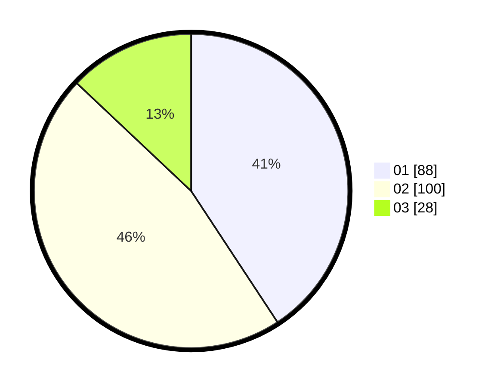

# Hasil

Hasil perolehan suara paslon dapat dilihat pada file paslon-01.txt, paslon-02.txt, dan paslon-03.txt.

Jika tidak ada, artinya data tersebut belum ada pada SIREKAP.

## Perolehan Suara

 * Paslon 01: **88**.
 * Paslon 02: **100**.
 * Paslon 03: **28**.

## Foto C Plano

https://sirekap-obj-formc.kpu.go.id/a042/pemilu/ppwp/31/71/04/10/06/3171041006011-20240217-133607--51567269-6851-4200-8452-9b4129001634.jpg

https://sirekap-obj-formc.kpu.go.id/a042/pemilu/ppwp/31/71/04/10/06/3171041006011-20240217-133857--b4c932e7-78cc-4516-97ec-e7ea7eb97770.jpg

https://sirekap-obj-formc.kpu.go.id/a042/pemilu/ppwp/31/71/04/10/06/3171041006011-20240217-134115--bb5f9507-46ec-4681-a49c-5c5221c1102a.jpg

## DATA PEMILIH TETAP

Jumlah pemilih dalam DPT: **295**.
 * L: **151**.
 * P: **144**.

## DATA PENGGUNA HAK PILIH

Jumlah pengguna hak pilih dalam DPT: **220**.
 * L: **116**.
 * P: **104**.

Jumlah pengguna hak pilih dalam DPTb: **0**.
 * L: **0**.
 * P: **0**.

Jumlah pengguna hak pilih dalam DPK: **0**.
 * L: **0**.
 * P: **0**.

Jumlah pengguna hak pilih: **220**.
 * L: **116**.
 * P: **104**.

## JUMLAH SUARA SAH DAN TIDAK SAH

JUMLAH SELURUH SUARA SAH: **216**.

JUMLAH SUARA TIDAK SAH: **4**.

JUMLAH SELURUH SUARA SAH DAN SUARA TIDAK SAH: **220**.
